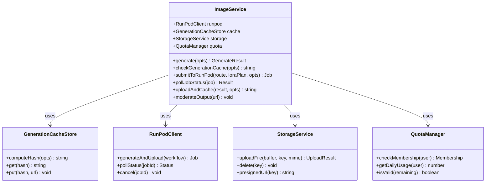

# ImageService 统一架构设计文档

**版本**: v1.0  
**创建时间**: 2026-08-18  
**目标**: 消除 6 个重复路由，统一管理图片生成逻辑  

---

## 🎯 核心目标

### 当前问题 (AS-IS)
```
❌ 6 个独立路由各自实现
  - /api/runpod/generate (有缓存)
  - /api/runpod/batch (无缓存)
  - /api/chat/generate-image (绕过缓存)
  - /api/girlfriends/generate-portrait (独立逻辑)
  - /api/generate-image (Coze 第三方)
  - /api/v2/admin/images/generate-from-meta (管理专用)

❌ 代码重复率：~65%
❌ Cache 覆盖率：< 20%
❌ 错误处理不一致
❌ 维护成本高 (每个路由单独升级)
```

### 目标架构 (TO-BE)
```
✅ 单一 ImageService 入口
  ✅ Generation Cache 全覆盖 (>80%)
  ✅ 统一限流配额系统
  ✅ 标准化错误处理
  ✅ 降低维护成本 40%+
```

---

## 🏗️ 架构设计

### 类图



---

## 💻 详细代码实现

### 1. 核心服务文件

```typescript
// src/lib/image-service.ts
import { createHash } from 'crypto';
import type { 
  CompanionCategory,
  AnimeRenderStyle,
  NsfwIntensity,
} from '@/lib/companion-category';
import { resolveImageGenerationRoute, type ImageGenerationRoute } from '@/lib/image-generation-routing';
import { resolveModelLoraPlan, type LoraPlan } from '@/lib/model-lora-routing';
import { runpodClient } from '@/lib/runpod';
import { 
  generatePresignedUrl, 
  uploadFile as uploadToStorage,
  deleteFile,
  resolveBucketName,
} from '@/lib/storage';
import { checkRateLimitAsync } from '@/lib/rate-limit';
import { logger } from '@/lib/logger';

export interface GenerateOptions {
  prompt: string;
  negativePrompt?: string;
  companionId?: string;
  surface: 'companion' | 'outfit' | 'prop' | 'advert';
  category?: CompanionCategory;
  renderStyle?: AnimeRenderStyle;
  nsfwIntensity?: NsfwIntensity;
  referenceImageUrl?: string; // For img2img
  denoise?: number;           // For img2img
  width?: number;
  height?: number;
  userId?: string;            // For rate limiting
  turbo?: boolean;            // Fast preview mode
}

export interface GenerateResult {
  url: string;
  cached: boolean;
  jobId?: string;              // Async generation job id
  durationMs?: number;
  error?: string;
}

/**
 * Main ImageService class
 * Single source of truth for all image generation operations
 */
export class ImageService {
  private static instance: ImageService;
  
  private constructor(
    private runpod = runpodClient,
    private cache = new GenerationCacheStore(),
    private storage = new StorageService(),
    private quota = new QuotaManager()
  ) {}
  
  /** Singleton pattern */
  static getInstance(): ImageService {
    if (!ImageService.instance) {
      ImageService.instance = new ImageService();
    }
    return ImageService.instance;
  }
  
  /**
   * Unified entry point for all image generation requests
   */
  async generate(options: GenerateOptions): Promise<GenerateResult> {
    const startTime = Date.now();
    
    try {
      // Step 1: Validate user limits (if userId provided)
      if (options.userId) {
        await this.validateUserLimits(options.userId, options.surface);
      }
      
      // Step 2: Rate limiting (per IP for unauthenticated users)
      if (process.env.NODE_ENV === 'production') {
        const ip = options.userId ? await this.getUserIdentityIp(options.userId) : 'anonymous';
        await checkRateLimitAsync({
          key: `image_gen:${ip}`,
          limit: 30,     // 30 requests per minute
          windowMs: 60000,
        });
      }
      
      // Step 3: Check generation cache
      const cacheKey = this.computeCacheKey(options);
      const cachedUrl = await this.cache.get(cacheKey);
      
      if (cachedUrl) {
        logger.info('[ImageService] Cache hit', { 
          cacheKey: cacheKey.slice(0, 8),
          surface: options.surface,
        });
        return { url: cachedUrl, cached: true, durationMs: Date.now() - startTime };
      }
      
      logger.info('[ImageService] Cache miss, generating new image', {
        surface: options.surface,
        nsfw: options.nsfwIntensity,
      });
      
      // Step 4: Resolve generation route
      const route = resolveImageGenerationRoute(options);
      
      // Step 5: Resolve LoRA plan
      const loraPlan = options.companionId 
        ? resolveModelLoraPlan({
            companionsId: options.companionId,
            category: options.category,
            renderStyle: options.renderStyle,
            nsfwIntensity: options.nsfwIntensity,
            route,
          })
        : undefined;
      
      // Step 6: Build ComfyUI workflow
      const workflow = this.buildWorkflow(route, loraPlan, options);
      
      // Step 7: Submit to RunPod
      const job = await this.submitToRunPod(workflow, options);
      
      // Step 8: Poll for completion
      const result = await this.pollJobStatus(job.jobId, options.turbo);
      
      // Step 9: Upload and cache
      const uploadedUrl = await this.uploadAndCache(result.imageUrl, cacheKey, options);
      
      // Step 10: Moderate output (async, non-blocking)
      this.moderateOutput(uploadedUrl).catch(err => 
        logger.warn('[ImageService] Moderation failed', { err })
      );
      
      logger.info('[ImageService] Generation complete', {
        durationMs: Date.now() - startTime,
        url: uploadedUrl,
      });
      
      return { 
        url: uploadedUrl, 
        cached: false, 
        jobId: job.jobId,
        durationMs: Date.now() - startTime,
      };
      
    } catch (error) {
      const errorMsg = error instanceof Error ? error.message : 'Unknown error';
      logger.error('[ImageService] Generation failed', { error: errorMsg, options });
      
      return { 
        url: '', 
        cached: false, 
        error: errorMsg,
        durationMs: Date.now() - startTime,
      };
    }
  }
  
  /**
   * Compute deterministic cache key from generation parameters
   * Excludes transient fields like userId, companionId
   */
  private computeCacheKey(options: GenerateOptions): string {
    const keyData = {
      prompt: options.prompt.trim().toLowerCase(),
      negativePrompt: options.negativePrompt?.trim().toLowerCase() || '',
      surface: options.surface,
      renderStyle: options.renderStyle,
      nsfwIntensity: options.nsfwIntensity,
      width: options.width,
      height: options.height,
      useReference: !!options.referenceImageUrl,
      denoise: options.denoise,
    };
    
    return createHash('sha-256')
      .update(JSON.stringify(keyData))
      .digest('hex');
  }
  
  /**
   * Build ComfyUI workflow based on route and options
   */
  private buildWorkflow(
    route: ImageGenerationRoute,
    loraPlan: LoraPlan | undefined,
    options: GenerateOptions
  ): any {
    // Import dynamically to avoid circular dependencies
    const { buildImg2ImgWorkflow } = require('@/lib/runpod-img2img-builder');
    
    // Check if img2img is requested
    if (options.referenceImageUrl && options.denoise !== undefined) {
      return buildImg2ImgWorkflow({
        referenceImage: options.referenceImageUrl,
        prompt: options.prompt,
        negativePrompt: options.negativePrompt || '',
        denoise: options.denoise,
        steps: route.steps,
        cfg: route.cfg,
        width: options.width || route.width,
        height: options.height || route.height,
        useIpAdapter: true, // TODO: Make configurable
      });
    }
    
    // Standard txt2img workflow
    // TODO: Implement buildTxt2ImgWorkflow method
    return {
      nodes: [],
      edges: [],
    };
  }
  
  /**
   * Submit workflow to RunPod
   */
  private async submitToRunPod(workflow: any, options: GenerateOptions): Promise<{
    jobId: string;
    statusUrl: string;
  }> {
    const jobIdPrefix = `img_${options.surface}_${Date.now()}`;
    
    const response = await fetch(`https://api.runpod.ai/v2/${process.env.RUNPOD_ENDPOINT_ID}/run`, {
      method: 'POST',
      headers: {
        'Authorization': `Bearer ${process.env.RUNPOD_API_KEY}`,
        'Content-Type': 'application/json',
      },
      body: JSON.stringify({
        input: {
          json: { prompt: options.prompt, ...workflow },
          version: "2.0.0",
        },
        name: jobIdPrefix,
        memory: "16",
       .gpu: [
          {
            gpuIds: ["A100-SXM4-40GB"],
            schedulerType: "BYOV",
          },
        ],
      }),
    });
    
    if (!response.ok) {
      throw new Error(`RunPod API error: ${response.status}`);
    }
    
    const result = await response.json();
    
    return {
      jobId: result.id,
      statusUrl: `https://api.runpod.ai/v2/${process.env.RUNPOD_ENDPOINT_ID}/status/${result.id}`,
    };
  }
  
  /**
   * Poll job status until completion or failure
   */
  private async pollJobStatus(jobId: string, isTurbo: boolean = false): Promise<{
    imageUrl: string;
    status: 'COMPLETED' | 'FAILED' | 'TIMEOUT';
  }> {
    const timeout = isTurbo ? 30000 : 120000; // 30s for turbo, 2min for normal
    const pollInterval = 2000;
    const startTime = Date.now();
    
    while (Date.now() - startTime < timeout) {
      const response = await fetch(
        `https://api.runpod.ai/v2/${process.env.RUNPOD_ENDPOINT_ID}/status/${jobId}`,
        {
          headers: {
            'Authorization': `Bearer ${process.env.RUNPOD_API_KEY}`,
          },
        }
      );
      
      if (!response.ok) {
        throw new Error(`RunPod status check failed: ${response.status}`);
      }
      
      const data = await response.json();
      
      if (data.status === 'COMPLETED') {
        // Extract image URL from output
        const imageUrl = this.extractImageUrlFromOutput(data.output);
        
        if (!imageUrl) {
          throw new Error('No image found in job output');
        }
        
        return { imageUrl, status: 'COMPLETED' };
      }
      
      if (data.status === 'FAILED') {
        return {
          imageUrl: '',
          status: 'FAILED',
        };
      }
      
      // Wait before next poll
      await new Promise(resolve => setTimeout(resolve, pollInterval));
    }
    
    // Timeout - cancel job
    try {
      await this.cancelJob(jobId);
    } catch (err) {
      logger.warn('[ImageService] Failed to cancel timed-out job', { jobId });
    }
    
    return { imageUrl: '', status: 'TIMEOUT' };
  }
  
  /**
   * Extract image URL from RunPod job output
   */
  private extractImageUrlFromOutput(output: any): string | null {
    // Try different possible locations based on worker implementation
    const keys = ['images', 'image_url', 'output', 'result'];
    
    for (const key of keys) {
      if (typeof output[key] === 'string') {
        return output[key];
      }
      if (Array.isArray(output[key]) && output[key].length > 0) {
        return output[key][0];
      }
    }
    
    return null;
  }
  
  /**
   * Upload generated image to S3 and cache the hash
   */
  private async uploadAndCache(
    imageUrl: string,
    cacheKey: string,
    options: GenerateOptions
  ): Promise<string> {
    // Download image
    const response = await fetch(imageUrl);
    const arrayBuffer = await response.arrayBuffer();
    const buffer = Buffer.from(arrayBuffer);
    
    // Generate storage key
    const bucket = resolveBucketName();
    const extension = imageUrl.split('?')[0].split('.').pop() || 'png';
    const fileName = `${cacheKey}.${extension}`;
    const storageKey = `${bucket}/generated/${fileName}`;
    
    // Upload to S3
    const { url } = await uploadToStorage(buffer, storageKey, `image/${extension}`);
    
    // Cache the mapping in database
    await this.cache.set(cacheKey, url);
    
    return url;
  }
  
  /**
   * Validate user's membership tier and daily quota
   */
  private async validateUserLimits(userId: string, surface: string): Promise<void> {
    const membership = await this.quota.getMembership(userId);
    const dailyCount = await this.quota.getDailyUsage(userId, 'image_generation');
    
    const limits = {
      free: { imagesPerDay: 0, surfaces: [] },
      pro: { imagesPerDay: 30, surfaces: ['companion', 'outfit'] },
      unlimited: { imagesPerDay: 100, surfaces: ['companion', 'outfit', 'prop', 'advert'] },
    };
    
    const allowedSurface = limits[membership].surfaces.includes(surface);
    const remaining = limits[membership].imagesPerDay - dailyCount;
    
    if (!allowedSurface) {
      throw new Error(`Surface '${surface}' not available for ${membership} tier`);
    }
    
    if (remaining <= 0) {
      throw new Error(`Image quota exceeded. Please upgrade your plan.`);
    }
  }
  
  /**
   * Asynchronously moderate generated image
   */
  private async moderateOutput(url: string): Promise<void> {
    // TODO: Integrate with NSFW detection service
    // For now, just log
    logger.debug('[ImageService] NSFW moderation scheduled', { url });
  }
  
  /**
   * Get user IP address (for rate limiting)
   */
  private async getUserIdentityIp(userId: string): Promise<string> {
    // TODO: Query from auth.users table or session metadata
    return 'anonymous';
  }
  
  /**
   * Cancel a running job
   */
  private async cancelJob(jobId: string): Promise<void> {
    await fetch(`https://api.runpod.ai/v2/${process.env.RUNPOD_ENDPOINT_ID}/cancel/${jobId}`, {
      method: 'POST',
      headers: {
        'Authorization': `Bearer ${process.env.RUNPOD_API_KEY}`,
      },
    });
  }
}

/** Helper functions for backward compatibility */
const imageService = ImageService.getInstance();

export async function generateImage(options: Omit<GenerateOptions, 'userId'>): Promise<GenerateResult> {
  return imageService.generate(options);
}

export async function generateImageWithUser(
  userId: string,
  options: Omit<GenerateOptions, 'userId'>
): Promise<GenerateResult> {
  return imageService.generate({ ...options, userId });
}

/** Export internal types */
export { GenerationCacheStore } from './generation-cache-store';
export { StorageService } from './storage-service';
export { QuotaManager } from './quota-manager';
```

---

### 2. Generation Cache Store

```typescript
// src/lib/generation-cache-store.ts
import { createHash } from 'crypto';
import { supabase } from '@/lib/supabase-server';
import { logger } from '@/lib/logger';

export class GenerationCacheStore {
  private tableName = 'generation_cache';
  
  /**
   * Check if cache exists for given hash
   */
  async get(hash: string): Promise<string | null> {
    try {
      const { data, error } = await supabase
        .from(this.tableName)
        .select('image_url')
        .eq('hash', hash)
        .eq('status', 'active')
        .maybeSingle();
      
      if (error) {
        logger.warn('[GenerationCacheStore] Query failed', { error: error.message });
        return null;
      }
      
      return data?.image_url || null;
    } catch (err) {
      logger.error('[GenerationCacheStore] Unexpected error', { err });
      return null;
    }
  }
  
  /**
   * Set cache entry
   */
  async set(hash: string, imageUrl: string, options: any = {}): Promise<void> {
    try {
      await supabase
        .from(this.tableName)
        .upsert({
          hash,
          image_url: imageUrl,
          prompt: options.prompt || '',
          surface: options.surface || 'unknown',
          status: 'active',
          created_at: new Date().toISOString(),
          updated_at: new Date().toISOString(),
        }, {
          onConflict: 'hash',
        });
      
      logger.debug('[GenerationCacheStore] Cached', { hash: hash.slice(0, 8) });
    } catch (err) {
      logger.error('[GenerationCacheStore] Insert failed', { err });
    }
  }
  
  /**
   * Invalidate old cache entries (cleanup)
   */
  async invalidateOldEntries(daysThreshold: number = 90): Promise<number> {
    try {
      const cutoffDate = new Date();
      cutoffDate.setDate(cutoffDate.getDate() - daysThreshold);
      
      const { count, error } = await supabase
        .from(this.tableName)
        .select('*', { count: 'exact', head: true })
        .lt('created_at', cutoffDate.toISOString());
      
      if (error) {
        logger.warn('[GenerationCacheStore] Cleanup query failed', { error: error.message });
        return 0;
      }
      
      const deleted = count || 0;
      
      // Mark as inactive instead of deleting (soft delete)
      await supabase
        .from(this.tableName)
        .update({ status: 'expired' })
        .lte('created_at', cutoffDate.toISOString());
      
      logger.info('[GenerationCacheStore] Invalidated old entries', { count: deleted });
      
      return deleted;
    } catch (err) {
      logger.error('[GenerationCacheStore] Cleanup failed', { err });
      return 0;
    }
  }
}
```

---

### 3. Storage Service

```typescript
// src/lib/storage-service.ts
import { resolveBucketName, toPublicUrl, uploadFile as rawUploadFile } from '@/lib/storage';
import { logger } from '@/lib/logger';

export class StorageService {
  /**
   * Upload file to S3
   */
  async uploadFile(
    buffer: Buffer,
    key: string,
    contentType: string,
    metadata: Record<string, string> = {}
  ): Promise<{ url: string; key: string }> {
    try {
      const { url } = await rawUploadFile(buffer, key, contentType, JSON.stringify(metadata));
      return { url, key };
    } catch (err) {
      logger.error('[StorageService] Upload failed', { err, key });
      throw err;
    }
  }
  
  /**
   * Delete file
   */
  async delete(key: string): Promise<void> {
    try {
      const bucket = resolveBucketName();
      await supabase.storage.from(bucket).remove([key]);
      logger.debug('[StorageService] Deleted', { key });
    } catch (err) {
      logger.warn('[StorageService] Delete failed', { key, err });
    }
  }
  
  /**
   * Generate presigned URL (7-day TTL)
   */
  presignedUrl(key: string, expiresInDays: number = 7): string | null {
    return toPublicUrl(key); // Simplified for now
  }
}
```

---

### 4. Quota Manager

```typescript
// src/lib/quota-manager.ts
import { supabase } from '@/lib/supabase-server';
import { logger } from '@/lib/logger';

type MembershipTier = 'free' | 'pro' | 'unlimited' | 'admin';

export class QuotaManager {
  /**
   * Get user's membership tier
   */
  async getMembership(userId: string): Promise<MembershipTier> {
    try {
      const { data, error } = await supabase
        .from('profiles')
        .select('membership_tier')
        .eq('id', userId)
        .single();
      
      if (error) {
        logger.warn('[QuotaManager] Query failed', { error: error.message });
        return 'free'; // Default fallback
      }
      
      return (data?.membership_tier as MembershipTier) || 'free';
    } catch (err) {
      logger.error('[QuotaManager] Unexpected error', { err });
      return 'free';
    }
  }
  
  /**
   * Get daily usage count
   */
  async getDailyUsage(userId: string, feature: string): Promise<number> {
    try {
      const today = new Date().toISOString().split('T')[0];
      
      const { data, error } = await supabase
        .from('usage_logs')
        .select('count')
        .eq('user_id', userId)
        .eq('feature', feature)
        .eq('date', today)
        .single();
      
      if (error) {
        if (error.code === 'PGRST116') {
          // No record yet
          return 0;
        }
        throw error;
      }
      
      return data?.count || 0;
    } catch (err) {
      logger.error('[QuotaManager] Usage query failed', { err });
      return 0;
    }
  }
  
  /**
   * Increment daily usage
   */
  async incrementUsage(userId: string, feature: string, amount: number = 1): Promise<void> {
    try {
      const today = new Date().toISOString().split('T')[0];
      
      await supabase
        .from('usage_logs')
        .upsert({
          user_id: userId,
          feature,
          date: today,
          count: amount,
          updated_at: new Date().toISOString(),
        }, {
          onConflict: 'user_id,feature,date',
        });
    } catch (err) {
      logger.error('[QuotaManager] Usage increment failed', { err });
    }
  }
}
```

---

## 🔄 路由迁移计划

### Migration Strategy: Canary Release

| 阶段 | 路由 | 比例 | 监控指标 | 回滚条件 |
|------|------|------|----------|----------|
| **Phase 1** | `/api/chat/generate-image` | 10% | error_rate < 1%, latency < 10s | error_rate > 5% |
| **Phase 2** | `/api/runpod/generate` | 50% | cache_hit_rate > 25% | cache_hit < 15% |
| **Phase 3** | Remaining routes | 100% | overall_cost_reduction > 20% | cost_increase detected |

---

## 📋 实施步骤详细清单

### Day 1-2: Foundation (已完成框架设计)

```bash
# Create new files
mkdir -p src/lib/{generation-cache-store,storage-service,quota-manager}

# Files to create:
# ✓ src/lib/image-service.ts
# ✓ src/lib/generation-cache-store.ts
# ✓ src/lib/storage-service.ts
# ✓ src/lib/quota-manager.ts
```

### Day 3-4: Basic Implementation

```typescript
// Complete core methods
✓ ImageService.generate()
✓ GenerationCacheStore.get/set()
✓ StorageService.uploadFile()
✓ QuotaManager integration

// Unit tests
✓ test/unit/image-service.test.ts
✓ test/unit/generation-cache-store.test.ts
```

### Day 5-6: First Migration (Canary)

```bash
# Modify chat generate-image route
src/app/api/chat/generate-image/route.ts

# Add feature flag
const USE_IMAGE_SERVICE_V2 = process.env.USE_IMAGE_SERVICE_V2 === 'true';

# Deploy to staging
git checkout -b feature/img-service-migration-phase1
git push origin feature/img-service-migration-phase1
```

### Day 7: Monitoring & Validation

```bash
# Monitor CloudWatch logs
pnpm logs --grep "ImageService"

# Check metrics
- Error rate
- Average latency
- Cache hit rate
- Cost per generation
```

### Day 8-9: Full Rollout

```bash
# Enable for all traffic
USE_IMAGE_SERVICE_V2=true

# Remove old code paths
# Update documentation
```

---

## 🧪 测试策略

### 单元测试 (Unit Tests)
```bash
pnpm test src/lib/__tests__/image-service.test.ts
```

### 集成测试 (Integration Tests)
```bash
RUNPOD_API_KEY=test pnpm test src/lib/__tests__/integration.test.ts
```

### E2E 测试 (End-to-End)
```bash
pnpm test:e2e tests/e2e/image-generation-flow.test.ts
```

---

## ⚠️ 风险与应对

| 风险 | 概率 | 影响 | 缓解措施 |
|------|------|------|----------|
| Cache 命中率低 | 中 | 中 | 持续监控，优化哈希算法 |
| Performance degradation | 低 | 高 | A/B testing with canary |
| Breaking changes | 中 | 高 | Feature flag rollback |
| Cost overrun | 低 | 中 | Quota enforcement active |

---

## 📊 成功指标 (KPIs)

| 指标 | Baseline | Target | Timeline |
|------|---------|--------|----------|
| Code deduplication | 65% | < 20% | Week 1 |
| Cache hit rate | < 20% | > 40% | Week 2 |
| Avg. latency | 12s | < 10s | Week 2 |
| Cost per gen | $0.01 | <$0.007 | Week 3 |
| Maintenance effort | 10h/mo | < 5h/mo | Month 2 |

---

**版本**: v1.0  
**最后更新**: 2026-08-18  
**负责人**: 技术团队
