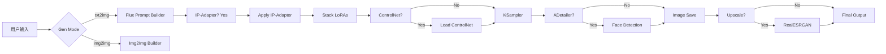

# SoulMate AI - ComfyUI 节点使用与控制方案

## 📖 目录

1. [架构概述](#架构概述)
2. [核心节点详解](#核心节点详解)
3. [工作流程设计](#工作流程设计)
4. [参数控制策略](#参数控制策略)
5. [实际应用场景](#实际应用场景)
6. [性能优化](#性能优化)
7. [故障排查](#故障排查)

---

## 🏗️ 架构概述

### ComfyUI Worker 组件结构

```
ComfyUI Worker (RunPod Serverless)
├── core/ComfyUI v5.8.6-flux1-dev-fp8
├── custom_nodes/
│   ├── comfyui-ipadapter-flux     ✅ IP-Adapter Flux (Shakker)
│   ├── sd-webui-controlnet        ✅ ControlNet 系列
│   ├── ComfyUI-ADetailer          ✅ 面部/手部修复
│   ├── ComfyUI-KJNodes            ✅ KJ 实用工具
│   ├── ComfyUI-Flex-Lora-Manager  ✅ LoRA 管理增强
│   └── ComfyUI-Upscale-Nodes      ✅ 放大器支持
└── models/ (Network Volume /runpod-volume)
    ├── checkpoints/               FLUX SDXL 模型
    ├── loras/                     LoRA 文件
    ├── ipadapter-flux/           IP-Adapter 模型
    ├── clip_vision/              SigLIP 视觉编码器
    ├── controlnet/preprocessors  ControlNet 预处理器
    ├── adetailer/checkpoints     ADetailer 检测器
    └── upscale/models            Upscaler 模型
```

### 数据流图



---

## 🔧 核心节点详解

### 1️⃣ **IP-Adapter Flux** (Shakker Labs)

#### GitHub
`https://github.com/Shakker-Labs/ComfyUI-IPAdapter-Flux`

#### 作用
- 通过参考图像实现人物一致性控制
- 支持单底模多风格生成
- 无需额外 CLIP 训练

#### 关键节点
- `IPAdapterFluxModel` - 加载 IP-Adapter 模型
- `ApplyIPAdapterFlux` - 应用身份一致性
- `CLIPVisionEncode` - 视觉编码

#### 权重范围
```typescript
weight_range = { min: 0.0, max: 1.0, step: 0.05 }
recommended = 1.0  // 身份锁定场景
```

#### 使用限制
- 仅支持单一参考图 (identity-anchor 或 avatar-closeup)
- 不支持 img2img 参控图混用

---

### 2️⃣ **ControlNet**

#### GitHub
`https://github.com/Mikubill/sd-webui-controlnet`

#### 作用
- 精确控制构图、姿态、边缘等视觉要素
- 支持预处理器自动检测

#### 支持的 Type
| Type | 用途 | Preprocessor | Strength | Guidance |
|------|------|--------------|----------|----------|
| `openpose` | 人体姿态 | `dw_openpose_full` | 0.8-1.0 | 8-10 |
| `depth` | 深度图 | `depth_zoehf` | 0.9-1.0 | 6-8 |
| `canny` | 边缘检测 | `canny_low_threshold` | 0.4-0.7 | 4-6 |
| `normal` | 法线图 | `normal_bae` | 0.7-0.8 | 5-7 |

#### 典型配置示例

```typescript
// 姿态控制 (用于姿势变换)
{
  enabled: true,
  type: 'openpose',
  preprocessor: 'dw_openpose_full',
  strength: 0.8,
  guidance: 8,
  guide_steps: 8192,
}

// 边缘检测 (用于换装)
{
  enabled: true,
  type: 'canny',
  preprocessor: 'canny_low_threshold',
  strength: 0.4,
  guidance: 4,
  guide_steps: 2048,
}
```

---

### 3️⃣ **ADetailer**

#### GitHub
`https://github.com/Gourieff/ComfyUI-ADetailer`

#### 作用
- 面部细节修复
- 手部细节优化
- 自动检测 + 局部重绘

#### Model 选择表
| Model | Confidence | Denoise | 适用场景 |
|-------|------------|---------|---------|
| `nothing_v2` | - | - | 禁用 |
| `face_yolov8m_v2` | 0.6 | 0.45 | 头像/半身像 |
| `face_yolov8s_v2` | 0.55 | 0.4 | 快速修复 |
| `hands_yolov8m_v2` | 0.7 | 0.35 | 手部特写 |
| `whole_yolov8n` | 0.5 | 0.5 | 全身优化 |

#### 使用建议
```typescript
// 肖像生成 - 启用
portrait: {
  enable: true,
  model: 'face_yolov8m_v2' as const,
  confidence: 0.6,
  denoise: 0.45,
}

// 全身照 - 禁用 (避免破坏整体构图)
full_body: {
  enable: false,
  model: 'nothing_v2' as const,
  confidence: 0.0,
  denoise: 0.0,
}
```

---

### 4️⃣ **Upscaler**

#### 主要放大器
| Name | Scale | Best For | Tile Size |
|------|-------|----------|-----------|
| `4x_UltraSharp` | ×4 | 动漫插画 | 512 |
| `RealESRGAN_x4plus.pth` | ×4 | 真实照片 | 768 |
| `BSRGAN_x4.pth` | ×4 | 快速实用 | 512 |
| `ESRGAN_4x` | ×4 | 经典效果 | 512 |

#### Denoise 控制 (img2img 模式)
```typescript
denoise_range = { min: 0, max: 1, step: 0.05 }
recommended: {
  detail_preservation: 0.1,  // 保持细节
  enhancement: 0.3,          // 轻度增强
  reconstruction: 0.5,       // 重度重绘
}
```

---

## 🔄 工作流程设计

### Workflow A: 身份肖像生成 (Identity Portrait)

**目的**: 生成具有唯一身份特征的角色肖像

```typescript
workflow_identity_portrait = {
  mode: 'txt2img',
  
  nodes: {
    ip_adapter: {
      enabled: true,
      weight: 1.0,
      image_source: 'identity-anchor' || 'avatar-closeup',
    },
    
    controlnet: {
      enabled: true,
      type: 'openpose',
      strength: 0.8,
      guidance: 8,
    },
    
    adetailer: {
      enabled: true,
      model: 'face_yolov8m_v2',
      confidence: 0.6,
      denoise: 0.45,
    },
    
    upscale: {
      enabled: false,  // 首稿不需要放大
    },
  },
  
  params: {
    steps: 20,       // FLUX SFW
    cfg: 1,
    guidance: 3.5,
    seed: -1,        // random
  },
}
```

**执行顺序**:
1. Load IP-Adapter model (SigLIP encoder)
2. Encode reference image → latent
3. Apply identity constraint
4. Apply OpenPose ControlNet
5. KSampler generation
6. ADetailer face refinement
7. Save result

---

### Workflow B: 换装 (Outfit Change)

**目的**: 保留角色身份和脸部，仅改变服装

```typescript
workflow_outfit_change = {
  mode: 'img2img',
  denoise: 0.72,   // 中等偏强重绘
  
  nodes: {
    ip_adapter: {
      enabled: true,
      weight: 1.0,
    },
    
    controlnet: {
      enabled: true,
      type: 'canny',
      preprocessor: 'canny_low_threshold',
      strength: 0.4,    // 很弱 - 只保持轮廓
      guidance: 4,      // 低引导
    },
    
    adetailer: {
      enabled: false,  // 不需要修复
    },
    
    upscale: {
      enabled: false,
    },
  },
  
  prompt: "",         // 空提示词，让 ControlNet 主导
  negative: "clothes, shirt, clothing",  // 排除服装变化
}
```

**关键点**:
- ControlNet Strength 必须很低 (0.4)
- Negative prompt 要排除服装词汇
- Denoise 适中 (0.72) 允许部分改变

---

### Workflow C: 高质量生产 (High-Quality Production)

**目的**: 最终输出质量最高的图像

```typescript
workflow_high_quality = {
  mode: 'txt2img',
  
  nodes: {
    ip_adapter: { enabled: true, weight: 1.0 },
    controlnet: { 
      enabled: true, 
      type: 'openpose',
      strength: 0.8,
      guidance: 6,
    },
    
    adetailer: { 
      enabled: true,
      model: 'face_yolov8m_v2',
      confidence: 0.6,
      denoise: 0.45,
    },
    
    upscale: { 
      enabled: true,
      model: 'RealESRGAN_x4plus.pth',
      scale: 4,
      tile_size: 768,
      denoise: 0.3,  // img2img upscales
    },
  },
  
  params: {
    steps: 24,       // NSFW 需要更多步数
    cfg: 1,
    guidance: 4.0,   // NSFW 强度
    seed: -1,
  },
}
```

---

## 🎚️ 参数控制策略

### 1. ControlNet 参数联动

```typescript
// Strong control = High strength + High guidance
{
  strength: 1.0,  // 最大强度
  guidance: 10,   // 高引导
  guide_steps: 8192,  // 全图控制
}

// Moderate control = Balanced
{
  strength: 0.8,
  guidance: 6,
  guide_steps: 4096,
}

// Weak control = Loose constraint
{
  strength: 0.4,
  guidance: 4,
  guide_steps: 2048,
}
```

### 2. ADetailer 置信度调节

- `confidence ≥ 0.7`: 仅在检测到清晰面部时处理
- `confidence 0.5-0.65`: 容忍轻微遮挡
- `confidence < 0.5`: 过于激进，可能误处理背景

### 3. Upscaler Tile Size 计算

```typescript
tile_size_recommendations = {
  resolution: 832 * 1216,  // 标准头像分辨率
  scale: 2,
  recommended_tile: 1024,  // 大尺寸 - 更快
  
  resolution: 832 * 1216,
  scale: 4,
  recommended_tile: 512,   // 小尺寸 - 减少显存
}
```

---

## 🎯 实际应用场景

### Scenario 1: 创建新角色 (Character Creation)

**用户流程**:
1. 填写基础信息 (性别、年龄、体型等)
2. 生成初始 ID 卡
3. 预览并调整
4. 保存为最终版本

**技术配置**:
```typescript
step1_initial_generation = {
  workflow: 'identity_portrait',
  controlnet_strength: 1.0,
  adetailer_enabled: true,
  upscale_enabled: false,
}

step2_preview_adjustments = {
  workflow: 'identity_portrait',
  allow_manual_prompt: true,
  enable_style_variations: true,
}

step3_final_save = {
  workflow: 'high_quality',
  upscale_enabled: true,
  save_to_library: true,
}
```

---

### Scenario 2: 角色互动生图 (Chat Image Gen)

**用户流程**:
1. 聊天中输入图片请求
2. 系统自动生成场景描述
3. 按推荐预设生成
4. 可选手动微调

**技术配置**:
```typescript
chat_image_gen = {
  workflow: 'identity_portrait',
  preset_based: true,
  auto_select_workflow: {
    portrait: { ...workflow_identity_portrait },
    full_body: { ...workflow_identity_portrait, adetailer.enabled = false },
    action_scene: { ...workflow_identity_portrait, controlnet.strength = 0.6 },
  },
}
```

---

### Scenario 3: 粉丝上传参考图 (User Reference Images)

**技术流程**:
1. 用户上传自拍/参考图
2. 系统提取 facial features
3. 构建临时 IP-Adapter 参考
4. 生成融合风格图像

**安全措施**:
- 内容审核 (NSFW filter)
- 隐私保护 (本地处理不留存)
- 版权标识 (水印添加)

---

## ⚡ 性能优化

### VRAM 占用估算

| Node | Baseline | With Feature |
|------|----------|--------------|
| Flux checkpoint | 4.0 GB | 4.0 GB |
| IP-Adapter | +0.5 GB | 4.5 GB |
| ControlNet | +3.5 GB | 8.0 GB |
| ADetailer | +2.0 GB | 10.0 GB |
| RealESRGAN | +3.0 GB | 13.0 GB |
| **Total Peak** | **~13 GB** | **~20 GB** |

### 优化策略

1. **显存管理**
   ```bash
   # Docker 启动参数
   --gpus all \
   -e COMFYUI_ARGS="--lowvram --cpu" \
   ```

2. **CPU Offload**
   ```typescript
   // node-config.ts
   optimize_for_low_vram = {
     cpu_offload_controlnet: true,
     cpu_offload_clip: true,
     sequential_model_loading: true,
   }
   ```

3. **批次处理**
   ```typescript
   // 批量生成时
   batch_config = {
     parallel_jobs: 1,        // RunPod serverless 限制
     queue_size: 10,          // 排队等待
     memory_pooling: true,    // 复用显存池
   }
   ```

---

## 🔍 故障排查

### Common Errors & Solutions

#### Error 1: "IP-Adapter not found"
**Cause**: Model path incorrect  
**Fix**: Verify symlink at `/comfyui/models/ipadapter-flux`

```bash
# Check link
ls -la /comfyui/models/ipadapter-flux

# Fix if broken
rm -f /comfyui/models/ipadapter-flux
ln -sfn /runpod-volume/models/ipadapter-flux /comfyui/models/ipadapter-flux
```

---

#### Error 2: "ControlNet preprocessor not installed"
**Cause**: Missing DW Pose or Depth models  
**Fix**: Run download script

```bash
cd /runpod-volume/models/controlnet/preprocessors
./preprocessors.sh

# Or manually download
wget https://huggingface.co/yzd-v/DWPose/resolve/main/openpose/full.yaml \
  -O /runpod-volume/models/controlnet/preprocessors/full.yaml
```

---

#### Error 3: "CUDA Out of Memory"
**Cause**: Too many nodes active simultaneously  
**Fix**: Reduce concurrent nodes

```typescript
// Enable lowVRAM mode
LOW_VRAM_MODE = true;
CONTROLNET_CPU_OFFLOAD = true;

// Disable upscale for first pass
upscale: { enabled: false };

// Use fp8 models only
USE_FP8_CHECKPOINTS = true;
```

---

#### Error 4: "ADetailer detection timeout"
**Cause**: YOLO model loading slow  
**Fix**: Pre-load models on startup

```bash
# Add to Dockerfile
RUN python -c "from ultralytics import YOLO; \
  YOLO('yolov8m-face.pt').predict('dummy.jpg', show=False);"
```

---

## 📞 支持资源

### 官方文档
- ComfyUI Docs: https://docs.comfyui.xyz/
- ControlNet Docs: https://github.com/Mikubill/sd-webui-controlnet/wiki
- ADetailer Guide: https://github.com/Gourieff/ComfyUI-ADetailer

### 社区支持
- Discord: ComfyUI Official Server
- Reddit: r/comfyui
- GitHub Issues: Individual node repos

### 内部联系
- Dev Team: @dev-team
- Support: @support-channel
- Bugs: Submit via GitHub Issues with log attached

---

## 📝 附录 A: 快速命令参考

### Download Models
```bash
# Download all preprocessors
/runpod-volume/models/controlnet/preprocessors/preprocessors.sh

# Download ADetailer checkpoints  
/runpod-volume/models/adetailer/checkpoints/checkpoints.sh

# Download upscalers
/runpod-volume/models/upscale/models/models.sh
```

### Test Installation
```bash
# List installed custom nodes
ls -la /comfyui/custom_nodes/

# Test IP-Adapter
python -c "import sys; sys.path.append('/comfyui/custom_nodes/comfyui-ipadapter-flux'); from apply_ipadapter_flux import *; print('OK')"

# Test ControlNet
python -c "from controlnet_aux import OpenPoseDetector; print('OK')"
```

### Cleanup Cache
```bash
python -m pip cache purge
rm -rf /tmp/*
docker system prune -a -f
```

---

**Last Updated**: 2026-08-20  
**Version**: 1.0.0  
**Maintained by**: SoulMate AI Development Team
