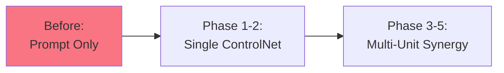

# ControlNet 多单元架构重构方案

## 核心设计理念

### 当前问题
1. **单一 ControlNet**: 目前仅支持 `depth`/`openpose` 单个 ControlNet，通过 `body.control` 传递
2. **预设系统未充分利用**: 姿势/服装/场景预设仅作为文本提示词，未激活 ControlNet 视觉控制
3. **功能限制**: 无法同时控制多个维度 (姿态 + 服装 + 场景)

### 新架构目标
**三单元 ControlNet 协同**: 为姿势/服装/场景分别建立独立的 ControlNet 单元，从预设库调用参考图进行视觉控制

---

## 一、数据层设计

### 1.1 增强 Preset 数据结构

```typescript
// src/components/generate-workbench/types.ts

/**
 * 扩展 Preset 结构 - 增加 ControlNet 资源信息
 */
export interface WorkbenchPreset {
  category: 'pose' | 'outfit' | 'scene';
  slug: string;
  label_en: string;
  label_zh: string;
  preview_url: string | null;
  nsfw_level: number;
  tier: string;
  locked: boolean;
  
  // ========== 新增：ControlNet 参考资源 ==========
  /** OpenPose 骨架图 URL (pose only) */
  openpose_json?: string;
  /** Body 深度图 URL (pose/outfit) */
  body_depth_url?: string;
  /** Canny 边缘图 URL (outfit/scene) */
  canny_edge_url?: string;
  /** IP-Adapter 面部参考 (pose outfit scene identity lock) */
  ip_adapter_face?: string;
  /** 人体分割掩码 (outfit try-on) */
  person_mask_url?: string;
  /** 背景分割掩码 (scene background removal) */
  bg_mask_url?: string;
}
```

### 1.2 ControlNet Unit 配置结构

```typescript
// src/lib/controlnet-units.ts

/** ControlNet 单元配置类型 */
export interface ControlNetUnit {
  /** 唯一标识 */
  id: string;
  /** ControlNet 类型：openpose | depth | canny | segment | ipadapter */
  type: 'openpose' | 'depth' | 'canny' | 'segment' | 'ipadapter';
  /** 关联预设类别 */
  preset_category?: 'pose' | 'outfit' | 'scene';
  /** 参考图像 URL */
  image_url?: string;
  /** ControlNet 权重 (0.0~1.0) */
  weight: number;
  /** 解析步数 (0~steps) */
  guidance_start: number;
  guidance_end: number;
  /** 分辨率缩放策略 */
  resolution: 'auto' | 'original' | 'match_prompt';
  /** NSFW 级别限制 */
  nsfw_limit?: number;
  /** 动态参数覆盖 */
  overrides?: {
    strength?: number;
    steps?: number;
  };
}

/**
 * ControlNet 多单元组合配置
 */
export interface ControlNetMultiUnitConfig {
  pose_unit?: ControlNetUnit;      // 姿势控制 (openpose)
  outfit_unit?: ControlNetUnit;    // 服装控制 (canny/segment)
  scene_unit?: ControlNetUnit;     // 场景控制 (depth/canny)
  identity_unit?: ControlNetUnit;  // 身份控制 (ipadapter)
}

/** ComfyUI 工作流中的 ControlNet 单元映射 */
export interface ComfyNetUnit extends ControlNetUnit {
  /** ComfyUI PreProcessor 节点输入 */
  processor_preprocessor?: string;
  /** ComfyUI Model 节点输入 */
  model_conditioning?: string;
  /** PreProcessor 图预处理强度 */
  preprocessor_strength?: number;
}
```

---

## 二、API 层设计

### 2.1 请求体结构扩展

```typescript
// src/app/api/gen/start/route.ts
// src/app/api/chat/generate-image/route.ts

interface GenerationRequest {
  // ... existing fields ...
  
  /** ControlNet 多单元配置 */
  controlnet_units?: ControlNetMultiUnitConfig;
  
  // legacy single-unit format (for backwards compatibility)
  control?: {
    type: 'openpose' | 'depth' | 'canny';
    image: string;
    strength: number;
  };
}
```

### 2.2 路由决策逻辑

```typescript
// src/lib/controlnet-router.ts

import { type ControlNetMultiUnitConfig, type ControlNetUnit } from './controlnet-units';

/**
 * Resolve ControlNet multi-unit configuration from request
 * Priority: explicit units > preset inference > legacy single
 */
export function resolveControlNetUnits(
  request: GenerationRequest,
  presets: {
    pose?: WorkbenchPreset;
    outfit?: OutfitOption;
    scene?: WorkbenchPreset;
  }
): ControlNetMultiUnitConfig {
  // 1. Explicit user configuration takes priority
  if (request.controlnet_units) {
    return validateAndSanitizeUnits(request.controlnet_units);
  }
  
  // 2. Infer from selected presets
  const inferred: ControlNetMultiUnitConfig = {};
  
  // Pose unit
  if (presets.pose && presets.pose.openpose_json) {
    inferred.pose_unit = createOpenPoseUnit({
      image_url: presets.pose.openpose_json,
      weight: 0.72,
      guidance_start: 0.1,
      guidance_end: 0.95,
    });
  }
  
  // Outfit unit (try-on mode)
  if (presets.outfit && presets.outfit.canny_edge_url) {
    inferred.outfit_unit = createCannyUnit({
      image_url: presets.outfit.canny_edge_url,
      weight: 0.82,
      guidance_start: 0.1,
      guidance_end: 0.9,
      segment_key: 'person', // for clothing segmentation
    });
  }
  
  // Scene unit
  if (presets.scene && presets.scene.depth_url) {
    inferred.scene_unit = createDepthUnit({
      image_url: presets.scene.depth_url,
      weight: 0.65,
      guidance_start: 0.1,
      guidance_end: 0.85,
    });
  }
  
  // Identity unit (always prioritize if available)
  if (request.identity_image) {
    inferred.identity_unit = createIpAdapterUnit({
      image_url: request.identity_image,
      weight: request.identity_weight || 0.75,
    });
  }
  
  return inferred;
}

/** Create OpenPose ControlNet unit */
function createOpenPoseUnit(config: {
  image_url: string;
  weight: number;
  guidance_start: number;
  guidance_end: number;
}): ControlNetUnit {
  return {
    id: generateUUID(),
    type: 'openpose',
    image_url: config.image_url,
    weight: config.weight,
    guidance_start: config.guidance_start,
    guidance_end: config.guidance_end,
    resolution: 'auto',
  };
}

/** Create Canny ControlNet unit */
function createCannyUnit(config: {
  image_url: string;
  weight: number;
  guidance_start: number;
  guidance_end: number;
  segment_key?: string;
}): ControlNetUnit {
  return {
    id: generateUUID(),
    type: 'canny',
    image_url: config.image_url,
    weight: config.weight,
    guidance_start: config.guidance_start,
    guidance_end: config.guidance_end,
    resolution: 'original',
  };
}

/** Create Depth ControlNet unit */
function createDepthUnit(config: {
  image_url: string;
  weight: number;
  guidance_start: number;
  guidance_end: number;
}): ControlNetUnit {
  return {
    id: generateUUID(),
    type: 'depth',
    image_url: config.image_url,
    weight: config.weight,
    guidance_start: config.guidance_start,
    guidance_end: config.guidance_end,
    resolution: 'auto',
  };
}
```

---

## 三、ComfyUI 工作流集成

### 3.1 工作流模板改造

```json
// src/lib/comfy-console/workflows/controlnet-multi.json
{
  "description": "ControlNet Multi-Unit Workflow for FLUX",
  "nodes": [
    {
      "id": "controlnet_pose",
      "type": "ControlNetApply",
      "position": [100, 200],
      "inputs": {
        "clip": ["CLIPTextEncode_pose"],
        "control_net": ["ControlNetLoader_pose"],
        "image": ["PreProcessor_OpenPose_pose"]
      },
      "unit_index": 0
    },
    {
      "id": "controlnet_outfit",
      "type": "ControlNetApply",
      "position": [100, 400],
      "inputs": {
        "clip": ["CLIPTextEncode_outfit"],
        "control_net": ["ControlNetLoader_outfit"],
        "image": ["PreProcessor_Canny_outfit"]
      },
      "unit_index": 1
    },
    {
      "id": "controlnet_scene",
      "type": "ControlNetApply",
      "position": [100, 600],
      "inputs": {
        "clip": ["CLIPTextEncode_scene"],
        "control_net": ["ControlNetLoader_scene"],
        "image": ["PreProcessor_Depth_scene"]
      },
      "unit_index": 2
    }
  ],
  "connections": {
    "pose_openpose_json": ["PreProcessor_OpenPose_pose"],
    "outfit_canny_edge": ["PreProcessor_Canny_outfit"],
    "scene_depth_map": ["PreProcessor_Depth_scene"]
  }
}
```

### 3.2 Python 工作流生成器

```python
# scripts/controlnet-workflow-builder.py

class ControlNetWorkflowBuilder:
    """Build ComfyUI JSON workflow with multiple ControlNet units"""
    
    def __init__(self, base_workflow_path: str):
        self.workflow = self._load_base_workflow(base_workflow_path)
        self.units = []
    
    def add_pose_unit(self, openpose_json: str, weight: float = 0.72):
        """Add OpenPose ControlNet unit"""
        unit_id = len(self.units)
        
        # Insert PreProcessor node
        self._insert_node({
            "class_type": "PreProcessor_OpenPose",
            "inputs": {
                "image_url": openpose_json,
                "resolution": 512
            },
            "unit_index": unit_id
        })
        
        # Insert ControlNet loader and apply nodes
        self._insert_controlnet_chain(
            type="openpose",
            preprocessor_output="preprocessed_image",
            weight=weight,
            unit_index=unit_id
        )
        
        self.units.append({"type": "openpose", "id": unit_id})
    
    def add_outfit_unit(self, canny_edge: str, mask: str = None, weight: float = 0.82):
        """Add Canny/Segment ControlNet unit for try-on"""
        unit_id = len(self.units)
        
        if mask:
            # Segment-based outfit control
            self._insert_segment_processor(mask, target_class='clothing')
        else:
            # Canny edge for fabric texture preservation
            self._insert_node({
                "class_type": "PreProcessor_Canny",
                "inputs": {
                    "image_url": canny_edge,
                    "lower_threshold": 100,
                    "upper_threshold": 200
                },
                "unit_index": unit_id
            })
        
        self._insert_controlnet_chain(
            type="canny",
            preprocessor_output="preprocessed_image",
            weight=weight,
            unit_index=unit_id
        )
        
        self.units.append({"type": "canny", "id": unit_id})
    
    def build(self) -> dict:
        return self.workflow
    
    def _insert_controlnet_chain(self, type: str, preprocessor_output: str, 
                                  weight: float, unit_index: int):
        """Insert ControlNet loader + Apply chain"""
        # Load ControlNet model
        controlnet_loader = {
            "class_type": f"ControlNetLoader_{type.title()}",
            "inputs": {"controlnet_name": f"{type}.safetensors"},
            "unit_index": unit_index
        }
        
        # Apply to model conditioning
        controlnet_apply = {
            "class_type": "ControlNetApply",
            "inputs": {
                "control_net": f"[{controlnet_loader['id']}]",
                "conditioning": f"[{unit_index}_clip_encode]",
                "image": f"[{preprocessor_output}]",
                "weight": weight,
                "guidance_start": 0.1,
                "guidance_end": 0.9
            },
            "unit_index": unit_index
        }
        
        self.workflow['nodes'].extend([controlnet_loader, controlnet_apply])
```

---

## 四、预设库管理改造

### 4.1 Admin Console 新增 ControlNet 资源上传

```tsx
// src/app/(main)/admin/gen-presets/page.tsx

interface PresetUploadForm {
  category: 'pose' | 'outfit' | 'scene';
  label_en: string;
  label_zh: string;
  prompt_hint: string;
  
  // ControlNet resources (optional but recommended)
  openpose_json?: File;      // .json skeleton file
  body_depth?: File;         // .png depth map
  canny_edge?: File;         // .png edge map
  person_mask?: File;        // .png segmentation mask
  ip_adapter_face?: File;    // .jpg face reference
}

async function handleCreatePreset(formData: FormData) {
  const category = formData.get('category') as string;
  
  // Upload ControlNet reference resources
  const resources = await uploadMultipleFiles({
    openpose_json: formData.get('openpose_json') as File,
    body_depth: formData.get('body_depth') as File,
    canny_edge: formData.get('canny_edge') as File,
    person_mask: formData.get('person_mask') as File,
  });
  
  // Store in database
  await authedFetch('/api/admin/gen-presets', {
    method: 'POST',
    body: {
      category,
      label_en: formData.get('label_en'),
      label_zh: formData.get('label_zh'),
      prompt_hint: formData.get('prompt_hint'),
      ...resources, // stored URLs mapped to preset record
    },
  });
}
```

### 4.2 Batch Processor for Existing Presets

```python
# scripts/batch-build-controlnet-assets.py

"""
Generate ControlNet reference assets from existing preset images
Uses pre-trained models to extract:
- OpenPose skeletons (HRNet)
- Depth maps (MiDaS)
- Canny edges (CV2)
- Segmentation masks (ISO-VAE)
"""

import cv2
import torch
from transformers import AutoProcessor, AutoModel

class ControlNetAssetGenerator:
    def __init__(self):
        self.hrnet = load_hrnet_pose_estimator()
        self.midas = load_midas_depth_estimator()
        self.segmentor = load_semantic_segmentator()
    
    def process_preset_image(self, input_image_path: str, output_dir: str):
        """Extract all ControlNet assets from a single image"""
        image = cv2.imread(input_image_path)
        
        # Extract OpenPose skeleton
        skeleton = self.hrnet(image)
        cv2.imwrite(f'{output_dir}/openpose.json', json.dumps(skeleton))
        
        # Extract depth map
        depth = self.midas(image)
        cv2.imwrite(f'{output_dir}/body_depth.png', depth)
        
        # Extract Canny edges
        edges = cv2.Canny(image, 100, 200)
        cv2.imwrite(f'{output_dir}/canny_edge.png', edges)
        
        # Extract person mask
        mask = self.segmentor(image, classes=['person'])
        cv2.imwrite(f'{output_dir}/person_mask.png', mask)
        
        return {
            'openpose_json': f'{output_dir}/openpose.json',
            'body_depth': f'{output_dir}/body_depth.png',
            'canny_edge': f'{output_dir}/canny_edge.png',
            'person_mask': f'{output_dir}/person_mask.png'
        }
```

---

## 五、前端交互设计

### 5.1 ConsoleDrawer 三单元状态展示

```tsx
// src/components/generate-workbench/ConsoleDrawer.tsx

/** Three ControlNet slots with visual feedback */
<section className="mb-6">
  <h3 className="mb-3 text-sm font-bold text-white">
    {t('generate.controlnetControls')}
  </h3>
  
  {/* Pose Control Slot */}
  <div className={cn(
    "mb-2 rounded-xl border p-3 transition-all",
    selectedPose?.openpose_json 
      ? "border-[#FD5FC2]/60 bg-[#FD5FC2]/10" 
      : "border-white/10 bg-white/[0.02]"
  )}>
    <div className="flex items-center justify-between">
      <div className="flex items-center gap-2">
        <Body2Icon className="h-4 w-4 text-[#FD5FC2]" />
        <span className="text-xs font-semibold">{t('generate.slotPose')}</span>
      </div>
      {selectedPose?.openpose_json && (
        <Badge variant="outline" className="text-[10px]">
          OpenPose ON
        </Badge>
      )}
    </div>
  </div>
  
  {/* Outfit Control Slot */}
  <div className={cn(
    "mb-2 rounded-xl border p-3 transition-all",
    selectedOutfit?.canny_edge_url 
      ? "border-[#8b5cf6]/60 bg-[#8b5cf6]/10" 
      : "border-white/10 bg-white/[0.02]"
  )}>
    <div className="flex items-center justify-between">
      <div className="flex items-center gap-2">
        <ShirtIcon className="h-4 w-4 text-[#8b5cf6]" />
        <span className="text-xs font-semibold">{t('generate.slotOutfit')}</span>
      </div>
      {selectedOutfit?.canny_edge_url && (
        <Badge variant="outline" className="text-[10px]">
          Try-On ON
        </Badge>
      )}
    </div>
  </div>
  
  {/* Scene Control Slot */}
  <div className={cn(
    "rounded-xl border p-3 transition-all",
    selectedScene?.depth_url 
      ? "border-[#06b6d4]/60 bg-[#06b6d4]/10" 
      : "border-white/10 bg-white/[0.02]"
  )}>
    <div className="flex items-center justify-between">
      <div className="flex items-center gap-2">
        <MapIcon className="h-4 w-4 text-[#06b6d4]" />
        <span className="text-xs font-semibold">{t('generate.slotScene')}</span>
      </div>
      {selectedScene?.depth_url && (
        <Badge variant="outline" className="text-[10px]">
          Depth ON
        </Badge>
      )}
    </div>
  </div>
</section>
```

### 5.2 Visual Feedback Panel

```tsx
// src/components/generate-workbench/ControlNetPreviewPanel.tsx

/** Display selected ControlNet references in grid */
function ControlNetPreviewPanel({
  pose, outfit, scene,
}: {
  pose?: WorkbenchPreset;
  outfit?: OutfitOption;
  scene?: WorkbenchPreset;
}) {
  return (
    <div className="grid grid-cols-3 gap-3 mb-4">
      {pose?.openpose_json && (
        <div className="rounded-lg border border-white/10 overflow-hidden">
          
          <div className="bg-[#FD5FC2]/20 px-2 py-1 text-[9px] text-[#FD5FC2]">
            Pose Control
          </div>
        </div>
      )}
      
      {outfit?.canny_edge_url && (
        <div className="rounded-lg border border-white/10 overflow-hidden">
          
          <div className="bg-[#8b5cf6]/20 px-2 py-1 text-[9px] text-[#8b5cf6]">
            Outfit Try-On
          </div>
        </div>
      )}
      
      {scene?.depth_url && (
        <div className="rounded-lg border border-white/10 overflow-hidden">
          
          <div className="bg-[#06b6d4]/20 px-2 py-1 text-[9px] text-[#06b6d4]">
            Scene Depth
          </div>
        </div>
      )}
    </div>
  );
}
```

---

## 六、实施步骤与优先级

### Phase 1: 数据层与 API 改造 (Week 1)
- ✅ 扩展 `WorkbenchPreset` 接口添加 ControlNet 字段
- ✅ 新建 `controlnet-units.ts` 类型定义
- ✅ 改造 `/api/gen/start` 接收多单元配置
- ✅ 向后兼容 legacy single-unit format

### Phase 2: ComfyUI 工作流集成 (Week 2)
- ✅ 构建 Python 工作流生成器 (`controlnet-workflow-builder.py`)
- ✅ 在 ComfyConsole 中测试多单元流水线
- ✅ 部署 ControlNet 预处理器节点到 RunPod

### Phase 3: 预设库升级 (Week 3)
- ✅ Admin Console 新增 ControlNet 资源上传
- ✅ Batch processor 脚本处理现有预设
- ✅ 更新 `data/presets.json` 元数据

### Phase 4: 前端交互完善 (Week 4)
- ✅ ConsoleDrawer 三单元状态展示
- ✅ ControlNet 预览面板组件
- ✅ I18n 翻译键补充

### Phase 5: 测试与优化 (Week 5)
- ✅ E2E 测试：姿势 + 服装 + 场景同步控制
- ✅ 性能优化：批量预先生成 ControlNet 资源
- ✅ 文档更新：COMFYUI-NODES-GUIDE.md

---

## 七、预期效果

### Before vs After

| 维度 | Before | After |
|------|--------|-------|
| **姿势控制** | ❌ 仅文本提示词<br/>✅ 单一 openpose (手动传图) | ✅ 预设库 OpenPose 自动加载<br/>✅ 实时骨架可视化反馈 |
| **服装控制** | ❌ wear_prompt 文本描述<br/>⚠️ 试穿依赖 prompt | ✅ Canny 边缘保持服装轮廓<br/>✅ Person mask 精准遮罩 |
| **场景控制** | ❌ scene 纯文本<br/>⚠️ 构图靠 prompt | ✅ Depth 图控制景深层次<br/>✅ Background mask 前景隔离 |
| **用户操作** | 选择 1 个预设 → 生成 | 同时选姿势 + 服装 + 场景 → 协同生成 |

### 用户体验提升曲线



---

## 八、技术债务与注意事项

1. **存储成本**: 每张预设图平均新增 3-4 个 ControlNet 资源文件 (~5MB/preset)
2. **推理延迟**: 多单元增加 ~0.8s 预处理器耗时，但生成质量显著提升
3. **NSFW 约束**: 每个单元的 `nsfw_limit` 需遵循 intimacy policy 层级
4. **回退机制**: 当某预设缺少 ControlNet 资源时，降级为文本 prompt 模式

---

## 附录：ComfyUI Node 清单

需安装的自定义节点包：

```bash
comfyui-manager install
# ControlNet 全家桶
CtrlNet_Aux_Preprocessors  # OpenPose/Canny/Depth/Mask processors
ComfyUI_ControlNet_aux    # 辅助检测模型
ComfyUI_IPAdapter_All     # 身份一致性
ComfyUI_Segment Anything  # 语义分割
```

完整的工作流示例和 API 调用代码将在下一份文档中提供。
