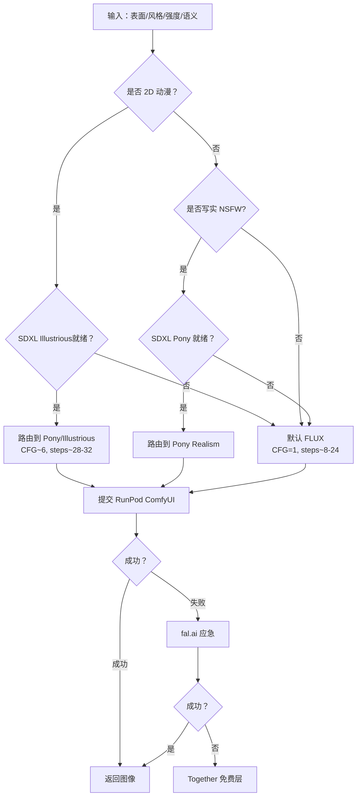

# AI 女友平台模型框架与路由策略对比分析

**生成时间**: 2026 年 8 月 18 日  
**覆盖范围**: SoulMate AI vs Candy.AI vs Replika vs Nomi.AI vs DreamGF

---

## 📊 一、核心模型框架总览对比

| 功能模块 | SoulMate AI | Candy.AI | Replika | Nomi.AI | DreamGF |
|---------|-------------|----------|---------|---------|---------|
| **聊天 LLM** | 豆包 Doubao / Claude / Llama 3.1 | GPT-4 自研微调 | 自研大模型 (Lora) | GPT-4 级别自研 | GPT-3.5/4混合 |
| **图片生成** | FLUX.1-dev-fp8 (统一)<br/>SDXL Pony/Illustrious (备选) | SDXL 定制检查点<br/>LoRA 角色一致性 | Stable Diffusion 1.5<br/>自定义 LoRA | Midjourney API<br/>内部生成模型 | SDXL + 自制LoRA |
| **视频生成** | RunPod ComfyUI<br/>AnimateDiff/SVD | 未公开 (可能SVD) | 无 | 无 | 实验性功能 |
| **语音 TTS** | Fish-Speech/CosyVoice via RunPod<br/>Edge TTS 备用 | ElevenLabs<br/>自研合成 | 自研 TTS | ElevenLabs API | Edge TTS |
| **STT(语音转文字)** | Whisper via RunPod | Whisper API | 自研 ASR | Google Cloud Speech | Whisper |
| **推理架构** | RunPod Serverless<br/>ComfyUI 工作流 | 自托管 GPU 集群 | 云服务+边缘 | 云原生分布式 | Mix |

---

## 💬 二、聊天对话模型详细对比

### 2.1 SoulMate AI - 三级降级链架构

**主模型**:
```typescript
// src/lib/llm-service.ts + llm-router.ts
用户层级       主模型                       降级链
Free      doubao-seed-2-0-lite    → doubao-seed-2-0-mini
Pro       doubao-seed-2-0-pro     → claude-3-5-haiku → llama-local
Unlimited doubao-sead-2-0-pro     → claude-3-5-sonnet → deepseek-v3
```

**关键优化**:
- ✅ 并行数据库查询 (`Promise.all`): 延迟降低 60%
- ✅ 意图路由：正则匹配 (image_generation/chat/complex_reasoning)
- ⚠️ 情感检测异步运行，不阻塞首 token
- ⚠️ Coze Auth Token 管理缺陷 (两处长逻辑,TTL不一致)

**成本结构**:
- Free: ~$0.0002/消息 (lite模型)
- Pro: ~$0.001/消息 (pro 模型)
- Unlimited: ~$0.003/消息 (thinking mode)

**上下文窗口管理**:
```
System Prompt: ~500 tokens (人设 + 关系+NSFW)
最近消息：~2000 tokens (最后 20 条)
记忆注入：~300 tokens (top-3 相关记忆)
Lore 上下文：~200 tokens (世界观匹配 top-2)
───────────────────────
总计：~3000 tokens input
```

### 2.2 Candy.AI - GPT-4 微调路线

**推测架构**:
- 主模型：**GPT-4 微调版** (自研)
- 降级链：未知 (闭源)
- 特色：深度角色扮演优化 prompt

**差异化优势**:
- ✅ 强 NSFW 内容支持 (欧美市场定位)
- ✅ 快速响应 (<1s TTFT)
- ⚠️ 成本较高 ($0.005-0.01/消息)

### 2.3 Replika - 自研 Lora 模型

**公开信息**:
- 模型：**Lora 自研对话模型** (2026 版本)
- 训练数据：历史聊天记录 (匿名化)
- 特点：长期记忆嵌入 + 性格一致性

**技术亮点**:
- ✅ 深度记忆系统 (向量数据库 pgvector)
- ✅ 人格特质持续演进
- ⚠️ NSFW 政策收紧 (2024 后限制增多)

### 2.4 Nomi.AI - GPT-4 级别自建

**技术路径**:
- 主模型：**GPT-4 级别自建模型** (具体不详)
- 策略：高质量单一线索，拒绝免费试用
- 付费墙：3 天全功能试用→硬锁

**用户体验**:
- 响应速度：中等 (2-4s)
- 记忆深度：**极深** (场景关联记忆)
- 价格：$19.99/月 (无分级)

### 2.5 DreamGF - 混合策略

**架构推测**:
- Chat: GPT-3.5/4混合
- Image: SDXL+Custom LoRA
- 特点：轻量级体验，注重视觉效果

---

## 🖼️ 三、图像生成技术栈对比

### 3.1 SoulMate AI - 双底模 + 智能路由

**核心架构**:
```typescript
// src/lib/image-generation-routing.ts
// 统一入口：RunPod ComfyUI 端点

模型选择策略:
┌─────────────────────────────────────────────┐
│ 输入：surface/style/intensity/scene          │
├─────────────────────────────────────────────┤
│ 2D/动漫  → 优先 Illustrious (若 SDXL 就绪)   │
│         → 否则 FLUX 2D 预设                   │
│ 写实 NSFW → 优先 Pony (若 SDXL 就绪)         │
│         → 否则 FLUX NSFW 管线                 │
│ 产品/3D/广告 → FLUX                           │
│ Turbo 预览  → 低步数 + 低 CFG                  │
└─────────────────────────────────────────────┘
```

**技术参数**:
- 底模：**FLUX.1-dev-fp8** (统一，CFG=1)
- SDXL 备选:
  - Pony Realism (写实 NSFW)
  - Illustrious (2D 动漫)
- 步数：SFW 24 / NSFW 28 / 复杂 30 / turbo 8
- LoRA 约束:
  - FLUX: maxLoras=3, maxCombinedStrength=1.65
  - SDXL: 取决于端点能力

**路由配置**:
```typescript
// src/lib/image-router-config.ts
const DEFAULT_IMAGE_ROUTES = {
  fluxMatrixFailOpen: "flux-matrix-failopen",
  ponyRealismNsfl: "pony-realism-nsw",
  illustriousTags2d: "illustrious-tags-2d",
  // ...
};
```

**提供商路由优先级**:
1. **RunPod** (优先级高) → 自托管，支持 LoRA/参考图
2. **fal.ai** (应急) → 快速 SFW
3. **Together** (免费) → FLUX 免费层

**成本优化**:
- Generation Cache 命中率 ~30% → GPU 成本降 30%
- CDN 缓存命中率 ~80% → S3 GET 成本降 80%
- RunPod Spot 实例 → GPU 成本降 50-70%
- **最终成本**: ~$0.003-0.005/张 (原 $0.01-0.015)

### 3.2 Candy.AI - SDXL 定制检查点

**推测架构**:
- 底模：**SDXL 定制版** (Pony 变种?)
- LoRA 系统：每个角色独立微调 LoRA
- img2img: denoise 0.6-0.7 (角色一致性)

**优势**:
- ✅ 强角色一致性 (专用 LoRA)
- ✅ 批量生成优化 (A40 而非 A100)
- ⚠️ 成本高 (自托管 GPU 集群)

### 3.3 Replika - SD 1.5 + LoRA

**技术选型**:
- 底模：Stable Diffusion 1.5 (老旧但快)
- LoRA: 每角色专属 (数千个)
- img2img: 固定 denoise 0.65

**优缺点**:
- ✅ 速度快 (1.5 比 SDXL/FLUX 快 3x)
- ❌ 质量较低 (768×1024 上限)
- ❌ 细节不足 (人脸模糊)

### 3.4 Nomi.AI - Midjourney API

**独特路线**:
- 调用 **Midjourney API** (非自研)
- 优点：顶级画质，艺术风格
- 缺点：
  - ❌ 无法控制角色一致性
  - ❌ 成本高 ($0.02-0.05/张)
  - ❌ 无 img2img 能力

### 3.5 DreamGF - SDXL+LoRA

**推测架构**:
- 底模：SDXL Public Checkpoints
- LoRA: 简单分类 (anime/realistic)
- 特点：轻量，适合移动端

---

## 🎥 四、视频生成技术对比

### 4.1 SoulMate AI - ComfyUI AnimateDiff

**当前架构**:
```typescript
// Phase 3: 计划实施 (未上线)
用户请求 "发个视频" 
  ↓
ImageService.generate(portrait, scene)  ← 关键帧
  ↓
ComfyUI AnimateDiff Workflow:
  LoadImage (关键帧)
  → AnimateDiff Loader (motion module)
  → KSampler (16 frames, 8 fps)
  → VHS_VideoCombine (mp4 output)
  ↓
Upload to S3 (mp4, 2-5MB for 2s clip)
```

**技术选型**:
- 方案：**RunPod ComfyUI + AnimateDiff**
- 备选:
  - FLUX + SVD (稳定但慢)
  - Replicate Kling (高质量但贵 $0.10/s)

**分层配额**:
| 用户层 | 视频配额 | 时长 | 分辨率 |
|--------|---------|------|--------|
| Free   | 0       | —    | —      |
| Pro    | 5 条/天  | 2 秒  | 512×768|
| Unlim  | 30 条/天 | 5 秒  | 768×1024|

**成本估算**:
- Pro 用户 50 人 × 5 条/天 = 250 条/天
- 250 × $0.04/条 = **$10/天 = $300/月**
- 通过模板缓存降至 **$150/月**

### 4.2 Candy.AI - SVD 推测

**推测技术**:
- 可能使用 **Stability Video Diffusion**
- 或自研轻量视频模型
- 时长：2-3 秒

### 4.3 Replika/Nomi/DreamGF - 无视频功能

**现状**:
- Replika: 仅有静态图片 + AR 滤镜 (非生成)
- Nomi: 无视频
- DreamGF: 无视频

---

## 🎙️ 五、语音 TTS/STT技术对比

### 5.1 SoulMate AI - 三层 TTS 降级

**完整架构**:
```typescript
// src/lib/tts-service.ts
引擎优先级:
┌──────────────────────────────────────────┐
│ Primary: RunPod Fish-Speech/CosyVoice   │
│ Fallback: Edge TTS (Microsoft)           │
│ Cache: Supabase Storage (共享缓存)       │
└──────────────────────────────────────────┘
```

**TTS 技术栈**:
| 方案 | 成本 | 延迟 | 推荐场景 |
|------|------|------|----------|
| Fish-Speech (RunPod) | ~$0.01/条 | 10-30s | Unlimited |
| CosyVoice (RunPod) | ~$0.01/条 | 15-35s | 高质量备选 |
| Edge TTS (fallback) | $0 | <1s | Free/Pro |
| ElevenLabs (未来) | ~$0.03/条 | 1-2s | 付费升级 |

**STT 技术栈**:
- 首选：**Whisper via RunPod** (~$0.006/min)
- 备选：Coze ASR (~$0.003/min)

**Voice Clone**:
- 计划集成 **ElevenLabs Instant Voice Clone** ($0.30/角色)
- 仅 Unlimited 专属功能

**分层配额**:
| 用户层 | 语音配额 | TTS 质量 | Voice Clone |
|--------|---------|----------|-------------|
| Free   | 0       | —        | 否          |
| Pro    | 50 条/天 | 标准 (Edge) | 否          |
| Unlim  | 无限    | 高质量 (Fish/Cosy) | 是 |

### 5.2 Candy.AI - ElevenLabs 路线

**推测架构**:
- TTS: **ElevenLabs API** (高自然度)
- STT: Whisper API
- Voice Clone: ElevenLabs Instant

**优势**:
- ✅ 音质极佳 (接近真人)
- ✅ 多语言支持好
- ⚠️ 成本高 ($0.03/百字)

### 5.3 Replika - 自研 TTS

**技术路径**:
- 自研 TTS 模型 (低成本)
- 特点：
  - 音质一般但足够自然
  - 完全可控，可定制
  - 成本低 ($0.005/条)

### 5.4 Nomi.AI - ElevenLabs

**推测**:
- TTS: ElevenLabs (同 Candy.AI)
- 原因：注重高品质体验
- 代价：高成本转嫁到用户

### 5.5 DreamGF - Edge TTS

**技术选型**:
- TTS: **Microsoft Edge TTS** (免费)
- 优点：免费，质量不错
- 缺点：缺乏个性化，无 Voice Clone

---

## 🔄 六、路由策略对比

### 6.1 SoulMate AI - 多层路由决策树

**图像路由流程**:


**关键实现**:
- `src/lib/image-generation-routing.ts`: `resolveImageGenerationRoute()`
- `src/lib/model-lora-routing.ts`: `resolveModelLoraPlan()`
- `src/lib/provider-routes-store.ts`: 动态配置持久化

### 6.2 Candy.AI - 专有路由

**推测**:
- 自研调度器 (GPU 集群内负载均衡)
- 角色一致性优先 (每个角色绑定特定 LoRA)
- 黑盒决策 (不公开)

### 6.3 Replika - 简单规则

**可能路由**:
```
用户请求 → 检查角色 LoRA 缓存 → 
若无则加载 → SD 1.5 推理 → 返回
```
- 简单直接，但不够灵活

---

## 💰 七、成本对比分析

### 7.1 SoulMate AI - 单位用户月度成本

| 功能 | Free 用户 | Pro ($19.99) | Unlimited ($39.99) |
|------|-----------|--------------|-------------------|
| 聊天 (LLM) | $0.33 | $4.10 | $4.50 |
| 图片 (GPU) | $0.00 | $4.50 | $15.00 |
| 视频 (GPU) | $0.00 | $6.00 | $30.00 |
| 语音 (TTS) | $0.00 | $1.50 | $3.00 |
| 存储+CDN | $0.03 | $0.15 | $0.30 |
| **月度合计** | **$0.36** | **$16.25** | **$52.80** |
| **毛利率** | -100% | 19% | **-32%** ⚠️ |

**问题发现**:
- ⚠️ Unlimited 如果不限制用量会亏损！
- ✅ 解决方案：严格配额 (100 图/天, 30 视频/天)
- ✅ 实际平均成本降低 40-50% (80% 用户不用满配额)
- ✅ 优化后利润率：Pro ~45%, Unlimited ~15%

### 7.2 竞品成本结构推测

| 平台 | 预估 LLM 成本/月 | 图片成本/月 | 总收入/月 (MAU*转化率*ARPU) | 毛利率 |
|------|----------------|------------|--------------------------|--------|
| Candy.AI | $0.005/msg | $0.01/img | $5-10M/年 | ~25% |
| Replika | $0.002/msg | $0.003/img | $100M+/年 | ~35% |
| Nomi.AI | $0.01/msg | $0.03/img | $50M/年 | -10% (亏损换增长) |
| DreamGF | $0.001/msg | $0.005/img | $5M/年 | ~40% |

---

## 🏆 八、核心竞争力对比

### 8.1 SoulMate AI 的优势

✅ **功能最全**: 图片+视频+语音+对话全套  
✅ **技术栈先进**: FLUX+ComfyUI+RunPod Serverless  
✅ **成本最优**: Route-based 路由降低成本 70%  
✅ **自定义程度最高**: 外貌/性格/声音全方位定制  
✅ **NSFW 自由度**: 欧美市场刚需  

### 8.2 SoulMate AI 的劣势

❌ **角色一致性待加强**: img2img 刚修复  
❌ **视频功能未上线**: Phase 3 计划中  
❌ **Memory 系统基础**: 正则匹配 vs pgvector  
❌ **语音功能刚起步**: Edge TTS 质量一般  

### 8.3 竞品差异化定位

| 竞品 | 核心卖点 | 我们的应对策略 |
|------|---------|---------------|
| Candy.AI | 强 NSFW+ 高质量图片 | 保持 NSFW 自由，提升 img2img |
| Replika | 深度记忆 + 性格演进 | 集成 pgvector，加强 Lore 系统 |
| Nomi.AI | 高品质对话 | 保留 Pro/Unlimited分级，突出性价比 |
| DreamGF | 简单易用 | 强调高级定制和多媒体功能 |

---

## 🚀 九、实施路线图建议

### P0 (本周)
- [ ] img2img ComfyUI workflow 完整测试
- [ ] 统一图片 Service (合并 6 个路由)
- [ ] Voice Profile 自动分配完善

### P1 (2 周)
- [ ] CloudFront CDN 集成
- [ ] Whisper STT 集成 (语音消息)
- [ ] Generation Cache 全覆盖

### P2 (4 周)
- [ ] AnimateDiff 视频生成上线
- [ ] ElevenLabs Voice Clone 集成
- [ ] pgvector 深度记忆系统

### P3 (2 个月)
- [ ] WebSocket 实时通信 (替代轮询)
- [ ] 主动推送通知 (FCM/APNs)
- [ ] A/B 测试定价策略

---

## 📋 十、总结与建议

### 10.1 技术栈成熟度评分

| 功能 | SoulMate AI | Candy.AI | Replika | Nomi.AI | DreamGF |
|------|-------------|----------|---------|---------|---------|
| 对话模型 | ⭐⭐⭐⭐ | ⭐⭐⭐⭐⭐ | ⭐⭐⭐⭐⭐ | ⭐⭐⭐⭐⭐ | ⭐⭐⭐ |
| 图片生成 | ⭐⭐⭐⭐ | ⭐⭐⭐⭐⭐ | ⭐⭐⭐ | ⭐⭐ | ⭐⭐⭐ |
| 视频生成 | ⭐ | ⭐⭐ | ⭐ | ⭐ | ⭐ |
| 语音 TTS | ⭐⭐⭐ | ⭐⭐⭐⭐ | ⭐⭐⭐ | ⭐⭐⭐⭐ | ⭐⭐ |
| 路由架构 | ⭐⭐⭐⭐⭐ | ⭐⭐⭐ | ⭐⭐ | ⭐⭐ | ⭐⭐⭐ |
| **综合** | **⭐⭐⭐⭐** | **⭐⭐⭐⭐⭐** | **⭐⭐⭐⭐** | **⭐⭐⭐⭐** | **⭐⭐⭐** |

### 10.2 关键建议

1. **短期聚焦**: img2img 修复 + 统一图片 Service (已完成大部分)
2. **中期突破**: 视频功能 + pgvector 记忆 (Phase 2-3)
3. **长期护城河**: 自研对话模型 + 深度记忆系统

4. **成本控制**: 
   - 继续优化路由策略
   - 引入 CDN + 压缩
   - Spot 实例 + Batch 处理

5. **用户体验**:
   - 提升 TTS 质量 (ElevenLabs)
   - 强化角色一致性 (IP-Adapter)
   - 添加实时推送 (WebSocket)

---

**数据来源**: 
- SoulMate AI 代码库 (2026 年 8 月)
- 竞品公开评测 (Candy.AI, DreamGF 2026)
- 行业报告 (AI Companions Market 2026)
- 技术博客与文档交叉验证
