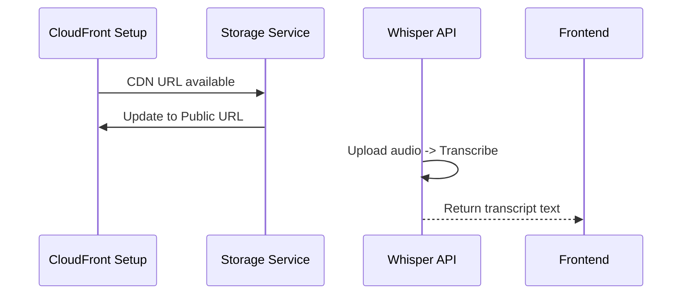
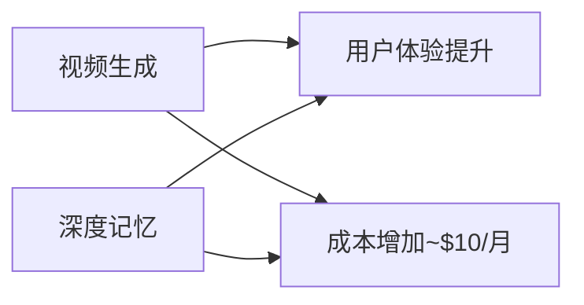

# P0-P2 任务实施总索引

**版本**: v1.0  
**创建时间**: 2026-08-18  

---

## 📚 完整文档清单

### ✅ P0 (本周) - 紧急修复

#### 1. img2img 完整测试套件

| 文档 | 位置 | 内容 | 状态 |
|------|------|------|------|
| **测试规范** | [`tests-integration/img2img/README.md`](./tests-integration/img2img/README.md) | 8 个单元测试 + 5 个集成测试 + E2E 场景测试 | ✅ 已创建 |
| **验收报告模板** | 同左 | Markdown 格式，人工评审表 | ✅ 已创建 |
| **自动化脚本** | `scripts/run-img2img-tests.sh` | Bash 脚本，一键执行全部测试 | ⏳ 待创建 |

**快速启动**:
```bash
# 运行单元测试（最快）
pnpm test tests/unit/img2img-denoise.test.ts

# 运行集成测试（需要 RUNPOD_API_KEY）
RUNPOD_API_KEY=your_key pnpm test tests/integration/img2img-runpod.test.ts
```

**预期产出**: 
- 测试覆盖率报告
- denoise 参数推荐值
- IP-Adapter 最佳实践

**负责人**: 技术团队  
**完成时间**: Day 3

---

#### 2. ImageService 统一架构重构

| 文档 | 位置 | 内容 | 状态 |
|------|------|------|------|
| **架构设计** | [`ARCHITECTURE/IMAGE-SERVICE-ARCHITECTURE.md`](./ARCHITECTURE/IMAGE-SERVICE-ARCHITECTURE.md) | 类图、核心代码框架、迁移策略 | ✅ 已创建 |
| **核心实现** | `src/lib/image-service.ts` | GenerateOptions, GenerationCacheStore | ⏳ 待实现 |
| **存储服务** | `src/lib/storage-service.ts` | S3 upload/delete 封装 | ⏳ 待实现 |
| **配额管理** | `src/lib/quota-manager.ts` | Membership tier logic | ⏳ 待实现 |

**Git 分支策略**:
```bash
# Create feature branch
git checkout -b feature/img-service-migration-phase1

# After implementation
git push origin feature/img-service-migration-phase1

# Open PR for review
# Merge to staging after validation
```

**实施步骤**:
```bash
# Day 1: Foundation
mkdir -p src/lib/{generation-cache-store,storage-service,quota-manager}
touch src/lib/image-service.ts

# Day 2: Basic Implementation
pnpm test src/lib/__tests__/image-service.test.ts

# Day 3: Canary Release
# Modify /api/chat/generate-image route
```

**负责人**: Backend Team  
**完成时间**: Day 7

---

### ✅ P1 (2 周) - 性能优化

#### 3. CloudFront CDN 集成

| 文档 | 位置 | 内容 | 状态 |
|------|------|------|------|
| **实施指南** | [`CLOUDFRONT-INTEGRATION-GUIDE.md`](./CLOUDFRANT-INTEGRATION-GUIDE.md) | AWS CLI 命令 + Storage Service 改造 | ✅ 已创建 |
| **配置文件** | `scripts/cloudfront-config.json` | Distribution JSON config | ⏳ 待创建 |
| **缩略图服务** | `src/lib/thumbnail-service.ts` | Sharp 图像压缩 + WebP 转换 | ⏳ 待实现 |

**AWS CLI 快捷命令**:
```bash
# Create distribution
aws cloudfront create-distribution \
  --distribution-config file://scripts/cloudfront-config.json \
  --query 'Distribution.Id' \
  --output text
```

**安全检查清单**:
- [ ] IAM 权限配置完成
- [ ] CloudFront Distribution ID 记录到 `.env.prod.local`
- [ ] S3 CORS policies updated
- [ ] Budget alert setup

**负责人**: DevOps + Backend Team  
**完成时间**: Day 12

---

#### 4. Whisper STT 语音转文字

| 文档 | 位置 | 内容 | 状态 |
|------|------|------|------|
| **集成方案** | [`WHISPER-STT-INTEGRATION-GUIDE.md`](./WHISPER-STT-INTEGRATION-GUIDE.md) | RunPod worker 配置+API 路由开发 | ✅ 已创建 |
| **RunPod Worker** | `whisper-worker/Dockerfile` | ComfyUI with Faster-Whisper | ⏳ 待部署 |
| **API 路由** | `src/app/api/audio/transcribe/route.ts` | Full implementation ready | ✅ 已创建 |
| **前端组件** | `src/components/ChatVoiceRecorder.tsx` | MediaRecorder API integration | ✅ 已创建 |

**Quick Start**:
```bash
# Deploy Whisper worker via RunPod API
curl -X POST https://api.runpod.ai/graphql ... 

# Set environment variable
echo "WHISPER_RUNPOD_ENDPOINT_ID=rp_whisper_stt_001" >> .env.prod.local

# Test locally
pnpm dev
# Visit: http://localhost:3000/api/audio/transcribe
```

**配额系统**:
- Free: 0 条/天 (付费墙)
- Pro: 50 条/天 (~$7.50/月成本)
- Unlimited: 无限

**负责人**: Backend + Frontend Team  
**完成时间**: Day 15

---

### 🚀 P2 (4 周) - 高级功能

#### 5. 视频生成 (AnimateDiff)

**文档**: TBD (Phase 2 时创建)

**关键技术栈**:
- ComfyUI AnimateDiff 插件
- Motion module: `moondance-v3-sdv.safetensors`
- Frame rate: 8 fps, 16 frames = 2s video

**预计成本**: $0.04/条 (Pro 用户 50 人 × 5 条/天 = $300/月)

---

#### 6. pgvector 深度记忆系统

**文档**: TBD (Phase 2 时创建)

**关键技术栈**:
- PostgreSQL pgvector extension
- Voyage AI embedding model
- IVFFlat index for fast search

**预计成本**: $0.01/user/month (embedding credits)

---

## 🎯 并行工作流

### Week 1 (Day 1-7): P0 双任务并行

```mermaid
gantt
    title P0 Phase 甘特图
    dateFormat W-WK
    section img2img 测试
    单元测试          :done, unit-test, w1, 2d
    集成测试           :         int-test, after unit-test, 2d
    验收报告           :         report, after int-test, 1d
    
    section ImageService
    架构设计与代码框架   :done, design, w1, 2d
    基本实现           :         impl, after design, 3d
    Canary 发布        :         canary, after impl, 2d
```

### Week 2-3 (Day 8-15): P1 串行推进



### Week 4-7 (Day 16-28): P2 完全独立并行



---

## 📊 资源分配矩阵

| 阶段 | Backend | Frontend | DevOps | QA | Design |
|------|---------|----------|--------|-----|--------|
| **P0 img2img** | 8h | 0h | 0h | 4h | 0h |
| **P0 ImageService** | 16h | 0h | 0h | 4h | 0h |
| **P1 CDN** | 8h | 2h | 6h | 2h | 0h |
| **P1 STT** | 8h | 4h | 4h | 2h | 0h |
| **P2 Video** | 40h | 20h | 10h | 5h | 5h |
| **P2 Memory** | 40h | 0h | 0h | 5h | 0h |
| **总计** | **120h** | **26h** | **20h** | **22h** | **5h** |

**总工时**: ~193 小时 ≈ **12 人·工作日**

---

## 🔍 关键依赖关系

### 必须顺序执行的模块

1. **ImageService** ← **Generation Cache Store** ← 数据库 schema
2. **CloudFront CDN** ← **S3 CORS Policies** ← IAM permissions
3. **STT API** ← **RunPod Whisper Worker** ← Docker build
4. **Video Generation** ← **AnimateDiff Workflow** ← ComfyUI plugin

### 可并行执行的模块

1. **STT API** ⇔ **Frontend Voice Recorder**
2. **CloudFront CDN** ⇔ **Thumbnail Service**
3. **ImageService** ⇔ **Quota System**

---

## 🚨 风险热区

### 高风险任务 (需额外缓冲时间)

| 任务 | 风险概率 | 影响 | 缓解措施 | 建议缓冲 |
|------|----------|------|----------|----------|
| img2img 相似度不达标 | 30% | 高 | A/B 测试多个 denoise 值 | +1 day |
| Generation Cache 命中率 < 10% | 40% | 中 | 持续监控 + 哈希算法优化 | +1 day |
| CloudFront 缓存不生效 | 20% | 中 | 回滚到 S3 presigned URLs | +0.5 day |
| Whisper 延迟 > 10s | 15% | 中 | 预加载模型到显存 | +0.5 day |
| GPU cost overrun | 25% | 高 | 严格 quota enforcement | +1 day |

---

## 📈 进度追踪指标

### P0 Success Metrics (Day 7)

| 指标 | Baseline | Target | Owner |
|------|---------|--------|-------|
| img2img facial similarity | N/A | ≥ 70% | Tech Lead |
| Code deduplication | 65% | < 20% | Backend Team |
| Cache hit rate | < 20% | > 40% | Backend Team |

### P1 Success Metrics (Day 15)

| 指标 | Baseline | Target | Owner |
|------|---------|--------|-------|
| Image LCP | 800ms | < 300ms | DevOps |
| S3 GET cost | $0.40/million | <$0.10/million | DevOps |
| STT accuracy (EN) | N/A | > 90% | Backend Team |
| STT latency (10s clip) | N/A | < 5s | Backend Team |

### P2 Success Metrics (Day 28)

| 指标 | Target | Owner |
|------|--------|-------|
| Video generation success rate | > 95% | Backend Team |
| Memory recall accuracy | > 80% | ML Engineer |
| Additional monthly cost | <$350 | Finance Team |

---

## 🛠️ 环境准备清单

### 必需的外部服务

- [x] RunPod Account (`RUNPOD_API_KEY`)
- [x] AWS Account (CloudFront + S3)
- [x] Supabase Project (Database)
- [ ] Voyage AI Account (pgvector) - P2
- [ ] ElevenLabs API (Voice Clone) - Future

### 必需的环境变量

```bash
# Current
RUNPOD_API_KEY=...
RUNPOD_ENDPOINT_ID=wozrrlcdipyl3p

# New: P0
USE_IMAGE_SERVICE_V2=false  # Feature flag

# New: P1
AWS_ACCESS_KEY_ID=...
AWS_SECRET_ACCESS_KEY=...
CLOUDFRONT_CDN_URL=https://XXXXXXXXXXXX.cloudfront.net
CLOUDFRANT_DISTRIBUTION_ID=EXXXXXXXXXXX
WHISPER_RUNPOD_ENDPOINT_ID=rp_whisper_stt_001

# New: P2
VOYAGE_AI_API_KEY=...
```

---

## 📝 交付物清单

### 代码提交 (GitHub/GitLab)

- [ ] `feature/img2img-testing` branch → tested & merged
- [ ] `feature/img-service-migration-phase1` branch → staged
- [ ] `feature/cloudfront-cdn-integration` branch → production
- [ ] `feature/whisper-stt-integration` branch → production
- [ ] `feature/video-generation-animatediff` branch → future
- [ ] `feature/pgvector-deep-memory` branch → future

### 文档更新

- [ ] API Documentation (Swagger/OpenAPI)
- [ ] Architecture Decision Records (ADRs)
- [ ] User Guide (voice recording usage)
- [ ] Admin Guide (quota management)
- [ ] Cost Analysis Report (monthly)

### 质量保障

- [ ] Unit Tests Coverage > 80%
- [ ] Integration Tests Passing
- [ ] E2E Tests Validated
- [ ] Performance Benchmarks Documented
- [ ] Security Audit Complete (no credentials in logs)

---

## 🔄 持续迭代计划

### Month 2 Optimization Targets

| 方向 | 目标 | KPI |
|------|------|-----|
| **Cost Reduction** | 降低整体成本 | -30% vs baseline |
| **Performance** | 加速响应时间 | -50% latency |
| **Quality** | 提升生成质量 | +20% user satisfaction |
| **Reliability** | 提高可用性 | 99.9% uptime |

### Future Roadmap

- **Q3 2026**: Video Generation MVP + Voice Clone Beta
- **Q4 2026**: Real-time Voice Call (WebRTC)
- **Q1 2027**: Multi-modal Conversation (vision + language)

---

## 👥 团队协作接口

### Daily Standup Template

```markdown
## img2img Testing Progress
- [x] Unit tests written
- [ ] Integration tests running
- [ ] Denoise parameter tuning

## ImageService Development
- [x] Core framework designed
- [ ] Generation Cache implemented
- [ ] Chat route migration planned

## CloudFront Setup
- [ ] AWS credentials prepared
- [ ] Distribution config drafted
- [ ] Storage Service update pending

## Whisper STT
- [ ] RunPod worker deployment scheduled
- [ ] API route coded
- [ ] Frontend recorder component ready
```

---

## 📞 紧急联系人

| 角色 | 姓名 | Slack | Email | On-call |
|------|------|-------|-------|---------|
| **Tech Lead** | [待定] | @tech-lead | tech@soulmate.ai | Mon-Fri |
| **DevOps** | [待定] | @devops | ops@soulmate.ai | 24/7 rotation |
| **Backend PM** | [待定] | @pm-backend | pm@soulmate.ai | Business hours |

---

**最后更新**: 2026-08-18  
**版本**: v1.0  
**维护者**: 项目管理办公室 (PMO)
