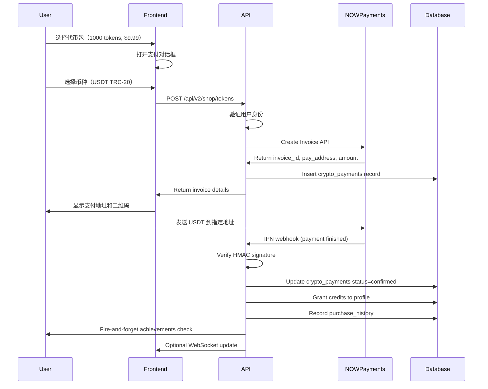

# NOWPayments 支付系统完整配置指南

## 📋 概述

本项目使用 **NOWPayments** 作为唯一的加密货币支付网关，支持以下币种：
- USDT (TRC-20, ERC-20)
- Bitcoin (BTC)
- Ethereum (ETH)
- Litecoin (LTC)
- Solana (SOL)
- BNB (BSC)
- TRON (TRX)

---

## 🔧 环境配置（.env.local）

### 必需的环境变量

```bash
# NOWPayments API 凭证
NOWPAYMENTS_API_KEY=your_api_key_here
NOWPAYMENTS_IPN_SECRET=your_ipn_secret_here
NOWPAYMENTS_PAY_CURRENCY=usdttrc20

# 充值代币价格（美分）
CRYPTO_TOKENS_500_PRICE=599
CRYPTO_TOKENS_1000_PRICE=999
CRYPTO_TOKENS_2500_PRICE=2299
CRYPTO_TOKENS_5000_PRICE=3999
CRYPTO_TOKENS_10000_PRICE=6999

# Supabase（处理支付记录）
COZE_SUPABASE_URL=https://xxx.supabase.co
COZE_SUPABASE_SERVICE_ROLE_KEY=your_service_role_key
```

### 环境变量说明

| 变量名 | 用途 | 获取方式 |
|--------|------|----------|
| `NOWPAYMENTS_API_KEY` | NOWPayments REST API 认证 | dashboard.nowpayments.io → Settings → API Keys |
| `NOWPAYMENTS_IPN_SECRET` | IPN 回调 HMAC 签名密钥 | dashboard.nowpayments.io → Settings → IPN Settings |
| `NOWPAYMENTS_PAY_CURRENCY` | 默认结算币种 | USDT、BTC、ETH 等（见 supported currencies） |
| `CRYPTO_TOKENS_*_PRICE` | 代币包 USD 价格（美分） | 根据定价策略调整 |

---

## 🚀 NOWPayments 平台配置

### 1. 注册账户
访问 [nowpayments.io](https://nowpayments.io) 注册企业账户

### 2. 获取 API 凭证

#### 生成 API Key:
1. 登录 dashboard.nowpayments.io
2. 进入 **Settings** → **API Keys**
3. 点击 **Generate new key**
4. 复制生成的 API Key 到 `.env.local`:
   ```bash
   NOWPAYMENTS_API_KEY=your_actual_api_key
   ```

#### 配置 IPN Secret:
1. 进入 **Settings** → **IPN Settings**
2. 开启 **Enable IPN notifications**
3. 复制显示的 **Secret Key** 到 `.env.local`:
   ```bash
   NOWPAYMENTS_IPN_SECRET=your_actual_ipn_secret
   ```
4. 在 **Callback URL** 中填写：
   ```
   https://www.oxmate-ai.com/api/nowpayments/ipn
   ```

### 3. 设置支持的货币

在 **Settings** → **General settings** 中选择：

✅ 启用的币种:
- USDT (TRC-20) - 推荐，低手续费
- USDT (ERC-20)
- BTC
- ETH
- LTC
- SOL
- BNB
- TRX

⚠️ 注意：确保你的钱包地址能接收所有选中的币种

### 4. 配置结算地址

在 **Settings** → **Wallets** 中添加：
- 主钱包地址（用于接收所有支付）
- 建议：使用硬件钱包或多签钱包以确保安全

### 5. 测试模式 vs 生产模式

#### 测试模式（Test Mode）:
```bash
# 在 NOWPayments dashboard 开启 Test mode
# 使用测试网络进行测试支付
```

#### 生产模式:
关闭 Test mode，启用真实资金流转

---

## 💻 代码集成检查点

### 已实现的组件:

#### ✅ 后端 API 路由

1. **POST /api/v2/shop/tokens**
   - 创建代币包购买发票
   - 调用 `nowPaymentsCreateInvoice()`
   - 返回发票 ID、支付地址、金额

2. **POST /api/nowpayments/ipn**
   - 处理支付完成的 Webhook
   - 验证 HMAC 签名
   - 自动发放代币余额
   - 更新 crypto_payments 表状态

3. **GET /api/v2/shop/tokens**
   - 获取可用代币包列表
   - 查询用户当前余额

#### ✅ 前端组件

1. **Shop Page (`src/app/(main)/shop/page.tsx`)**
   - 展示代币购买对话框
   - 选择加密货币币种
   - 显示支付地址和 QR 码

2. **CryptoPaymentModal** (如果有独立组件)

#### ✅ 服务器库

1. **`src/lib/nowpayments-server.ts`**
   - `nowPaymentsCreateInvoice()` - 创建发票
   - `nowPaymentsCreatePayment()` - 创建传统支付
   - `nowPaymentsGetPayment()` - 查询支付状态
   - `verifyNowPaymentsIPN()` - 验证 Webhook 签名

### 代码完整性检查

运行以下命令验证配置：

```bash
# 1. 检查环境变量是否完整
grep -E "^NOWPAYMENTS_" .env.local

# 2. 验证 API 连接性
curl -X GET "https://api.nowpayments.io/v1/status" \
  -H "x-api-key: $NOWPAYMENTS_API_KEY"

# 3. 测试发票创建（需先登录 Next.js）
# 访问 /shop?tab=tokens 并尝试购买代币包
```

---

## 🔒 安全配置

### 1. HMAC 签名验证

NOWPayments 使用 HMAC-SHA512 进行 IPN 签名验证：

```typescript
// src/lib/nowpayments-server.ts
export function verifyNowPaymentsIPN(body: string, signature: string): boolean {
  const secret = process.env.NOWPAYMENTS_IPN_SECRET;
  
  // 1. 将请求体转换为 hex 字符串
  const bodyHex = Buffer.from(body, 'utf8').toString('hex');
  
  // 2. 使用 HMAC-SHA512 计算签名
  const expectedSignature = crypto.createHmac('sha512', secret)
    .update(bodyHex, 'hex')
    .digest('hex');
  
  // 3. 常数时间比较防止时序攻击
  return crypto.timingSafeEqual(
    Buffer.from(signature.toLowerCase(), 'hex'),
    Buffer.from(expectedSignature.toLowerCase(), 'hex')
  );
}
```

### 2. 防重放攻击

通过 `crypto_payments` 表的 `tx_hash` 字段实现幂等性：

```sql
-- 检查支付是否已处理
SELECT id FROM crypto_payments 
WHERE tx_hash = :payment_id 
AND status = 'confirmed';
```

如果存在记录，直接返回 success 而不再次处理。

### 3. 金额验证

在 Webhook 中验证实际支付金额：

```typescript
const { actually_paid, price_amount } = data;
const minAmount = parseFloat(process.env.MIN_PAYMENT_AMOUNT || '10'); // 最小支付额

if (actually_paid < minAmount || actually_paid !== price_amount) {
  logger.warn('[ipn] Amount mismatch', { actually_paid, price_amount });
  return NextResponse.json({ error: 'Amount mismatch' }, { status: 400 });
}
```

---

## 📊 数据库表结构

### `crypto_payments` 表字段

```sql
CREATE TABLE crypto_payments (
  id UUID PRIMARY KEY DEFAULT gen_random_uuid(),
  user_id UUID NOT NULL REFERENCES auth.users(id),
  plan_id TEXT NOT NULL,          -- 如：'tokens-1000', 'pro-yearly'
  amount_usd DECIMAL(10,2) NOT NULL,
  currency TEXT NOT NULL,         -- 如：'USDT', 'BTC'
  tx_hash TEXT NOT NULL UNIQUE,   -- NOWPayments payment_id
  status TEXT NOT NULL DEFAULT 'awaiting_payment',
  -- Statuses: awaiting_payment, pending_verification, confirmed, rejected
  admin_notes TEXT,
  created_at TIMESTAMP WITH TIME ZONE DEFAULT NOW(),
  updated_at TIMESTAMP WITH TIME ZONE DEFAULT NOW()
);

-- 索引优化
CREATE INDEX idx_crypto_payments_user_id ON crypto_payments(user_id);
CREATE INDEX idx_crypto_payments_tx_hash ON crypto_payments(tx_hash);
CREATE INDEX idx_crypto_payments_status ON crypto_payments(status);
```

### 相关表

1. **`purchase_history`** - 购买历史记录
2. **`profiles.credits_remaining`** - 用户代币余额
3. **`subscriptions`** - 会员订阅（如果使用 NOWPayments 购买会员）

---

## 🧪 测试流程

### 1. 本地测试

```bash
# 启动开发服务器
pnpm dev

# 访问商城页面
open http://localhost:3000/shop?tab=tokens
```

### 2. 测试订单创建

选择任意代币包，选择 USDT(TRC-20)，点击支付：

**期望响应**:
```json
{
  "status": "invoice_created",
  "provider": "nowpayments",
  "invoice_id": "1234567890",
  "pay_address": "TxxxxxxxxxxxxxxxxxxxxxxxxxxxxXX",
  "pay_amount": 9.99,
  "amount_usd": 9.99,
  "pay_currency": "USDT",
  "package": {...},
  "token_count": 1000
}
```

### 3. 模拟 Webhook

使用 NOWPayments sandbox 或 Postman 发送测试 IPN：

```bash
curl -X POST https://www.oxmate-ai.com/api/nowpayments/ipn \
  -H "Content-Type: application/json" \
  -H "x-nowpayments-sig: your_signature_here" \
  -d '{
    "payment_id": "1234567890",
    "payment_status": "finished",
    "order_id": "np_user123_tokens_1000_1234567890",
    "actually_paid": 9.99,
    "price_amount": 9.99,
    "pay_currency": "USDT"
  }'
```

**期望响应**:
```json
{"success": true}
```

### 4. 验证余额增加

查询数据库确认用户余额已更新：

```sql
SELECT credits_remaining, membership_tier 
FROM profiles 
WHERE id = 'user_id_from_order_id';
```

---

## 🔄 支付流程图



---

## 📝 故障排查

### 常见问题

#### Q1: "Invalid signature" in IPN webhook
- **原因**: IPN_SECRET 配置错误或 body 格式不符
- **解决**: 
  1. 确保 `.env.local` 中 `NOWPAYMENTS_IPN_SECRET` 正确
  2. 检查 Webhook body 是否在计算签名时保持原样
  3. 查看日志确认签名生成过程

#### Q2: Invoice creation fails with HTTP 500
- **原因**: API_KEY 无效或网络问题
- **解决**:
  1. 验证 `NOWPAYMENTS_API_KEY` 是否正确
  2. 测试 API 连接：`curl -H "x-api-key: YOUR_KEY" https://api.nowpayments.io/v1/status`
  3. 检查网络能否访问 `api.nowpayments.io`

#### Q3: Webhook received but payment not processed
- **原因**: Payment status ≠ 'finished' or 'confirmed'
- **解决**:
  1. 在 NOWPayments dashboard 查看实际支付状态
  2. 确认 IPN callback URL 正确：`https://www.oxmate-ai.com/api/nowpayments/ipn`
  3. 检查防火墙是否阻止外部 IPN 请求

#### Q4: Credits not granted after confirmed payment
- **原因**: order_id 解析失败或幂等检查跳过
- **解决**:
  1. 检查 order_id 格式是否为 `np_{userId}_{type}_{params}_{timestamp}`
  2. 验证 `crypto_payments` 表中是否有重复记录的 tx_hash

---

## 🎯 最佳实践

### 1. 监控与告警

在 `/api/nowpayments/ipn` 中添加性能监控：

```typescript
const startTime = Date.now();
try {
  // ... processing logic
  const duration = Date.now() - startTime;
  if (duration > 5000) {
    logger.warn('[ipn] Slow processing', { duration, payment_id });
  }
} catch (err) {
  logger.error('[ipn] Failed', { err, duration: Date.now() - startTime });
  throw err;
}
```

### 2. 每日对账

定期导出 crypto_payments 数据与 NOWPayments dashboard 对比：

```sql
SELECT 
  DATE(created_at) as date,
  COUNT(*) FILTER (WHERE status='confirmed') as completed,
  SUM(amount_usd) FILTER (WHERE status='confirmed') as total_usd,
  currency,
  COUNT(DISTINCT user_id) as unique_users
FROM crypto_payments
WHERE created_at >= NOW() - INTERVAL '30 days'
GROUP BY DATE(created_at), currency
ORDER BY date DESC;
```

### 3. 汇率波动保护

建议在创建发票后立即锁定汇率：

```typescript
// 在 createInvoice 中已包含此功能
// NOWPayments 会自动计算并在 15 分钟内锁定汇率
```

---

## 📞 NOWPayments 技术支持

- **文档**: https://docs.nowpayments.io
- **API Playground**: https://docs.nowpayments.io/#intro
- **Status Page**: https://status.nowpayments.io
- **Support Email**: support@nowpayments.io
- **Telegram**: @nowpayments_support

---

## ✅ 配置清单

- [ ] 注册 NOWPayments 企业账户
- [ ] 获取 API Key 并配置到 `.env.local`
- [ ] 配置 IPN Secret 并设置 Callback URL
- [ ] 添加至少一个可接收资金的钱包地址
- [ ] 在 dashboard 启用所需的加密货币币种
- [ ] 测试环境：开启 Test mode 并完成测试支付
- [ ] 生产环境：关闭 Test mode，切换到真实 API
- [ ] 验证 `/api/v2/shop/tokens` 端点正常工作
- [ ] 验证 IPN webhook 签名验证逻辑
- [ ] 检查数据库表结构完整
- [ ] 配置监控和告警（可选）
- [ ] 记录交易日志并与 NOWPayments dashboard 对账

---

**最后更新时间**: 2026-09-21  
**版本**: v1.0  
**维护者**: [@zxixi778899](https://github.com/zxixi778899)
